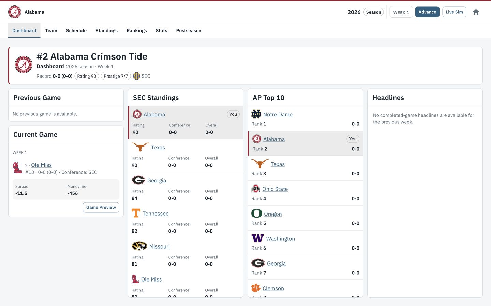

# CFB Sim

CFB Sim is a free, browser-based college football dynasty simulator. Choose a
program and an era, play through complete seasons, build your roster, and see
how your version of college football changes over time.

## [Play CFB Sim at cfbsim.com](https://cfbsim.com)

## Build Your Dynasty

Start in any season from 2000 through 2026 and take control of one of the
programs active in that season. You can use that era's conference alignment and
postseason format or reshape the sport with custom conferences and a 2-, 4-,
or 12-team playoff.

Once the season begins, you decide how quickly and closely to follow the action.
Simulate an entire week, select a game to watch, or step through a live game by
play or drive and make decisions when your team has the ball. Rankings,
standings, team and player statistics, awards, bowls, and the playoff all react
to the results.

The world continues after the championship. Players develop and graduate, new
recruits choose programs, rosters turn over, prestige changes, and the next
season begins. Team history, player careers, awards, postseason results, and
the seasons you complete remain part of the dynasty.

## How a Season Works

1. **Create the league.** Choose a starting season, a program, conference
   alignment, and postseason rules.
2. **Set the schedule.** Review rivalry games and fill your available
   non-conference dates before starting the season.
3. **Play the season.** Follow your team week by week, simulate games, and
   track the national picture through rankings, standings, statistics, awards,
   and postseason projections.
4. **Chase a championship.** Conference championships lead into the selected
   playoff format, bowl games, and the national championship.
5. **Run the offseason.** Review the completed season, configure the next one,
   develop returning players, recruit for six weeks, resolve Signing Day, and
   make the cuts needed for a legal 80-player roster.
6. **Keep building.** Begin the next season with the consequences and history
   of the dynasty carried forward.

## Recruiting and Roster Building

Recruiting is a six-week competition for a national pool of prospects. Build a
board of up to 25 targets, allocate your weekly points, and compare each
program's public interest. Prestige matters—especially for elite recruits—but
fit, playing time, proximity, recent success, roster need, and competition can
change an outcome.

Exact player ratings stay hidden until Roster Cuts. After Signing Day,
walk-ons fill any shortages and you choose the cuts that bring your team back
to 80 players while preserving the required positional depth.

## Your Save

CFB Sim stores one dynasty in IndexedDB on the browser and device where you
play. There is no account or cloud synchronization, so the save does not move
between browsers or devices. Clearing site data removes it, and starting a new
dynasty replaces the existing save.

For implementation and system details, see the
[technical documentation](docs/README.md).
