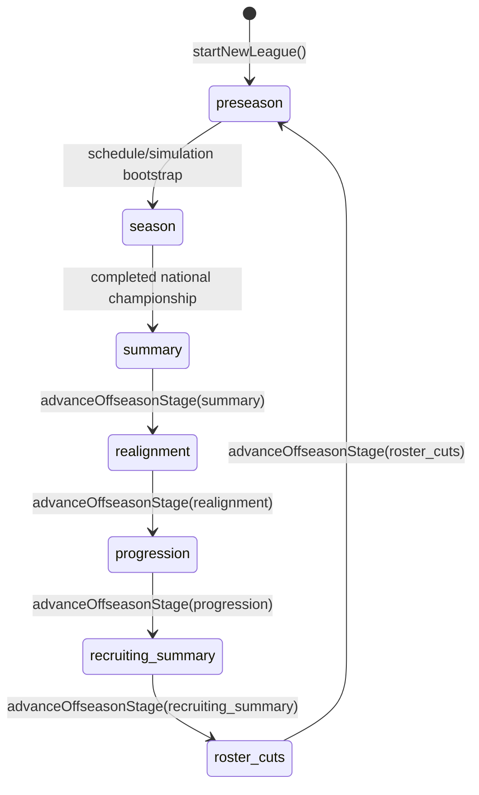

# Season State Machine

## Scope

Defines the authoritative lifecycle graph, transition guards, side effects, and
stage-gated loader behavior.

## Entry Points

- Initial stage creation: `startNewLeague(...)`.
- Season advancement: `advanceWeeks(destWeek)` and postseason gate
  `handleSpecialWeeks(...)`.
- Offseason advancement: `advanceOffseasonStage(expectedStage)`.
- Offseason route readers: `loadSeasonSummary()`, `loadRealignment()`,
  `loadRosterProgression()`, `loadRecruitingSummary()`, `loadRosterCuts()`,
  and `loadNonCon()`.

## Core Types and Stores

- `LeagueStage` defines all persisted stages; `OffseasonStage` defines valid
  command source stages.
- `STAGES` exhaustively defines each stage's label, authoritative route, and
  destination stage.
- `LeagueState.info.stage` is the authoritative stage holder.
- `LeagueState.info.currentWeek`, `currentYear`, and `lastWeek` hold the season
  cursor.
- The state machine is persisted in `league/current` in IndexedDB.
- Offseason commits may also include history, players, games, drives, plays,
  and game logs.

## Execution Flow

1. **Initialization**
- `startNewLeague()` creates `preseason`, settings, playoff state, counters,
  rosters, and initial scheduling data.

2. **Preseason to season**
- `loadDashboard()` builds the schedule and initializes simulation records when
  needed.
- `advanceWeeks()` enforces the same bootstrap before simulation.

3. **Season to summary**
- `advanceWeeks()` invokes `handleSpecialWeeks()` while simulating.
- The postseason gate enters `summary` only after the national championship has
  a winner and final rankings are available.

4. **Explicit offseason progression**
- `AppNavigation` calls `advanceOffseasonStage()` with the stage returned by
  the current loader.
- The command verifies the expected stage, prepares the existing domain work,
  and commits affected IndexedDB stores atomically.
- The exhaustive stage catalog supplies the command's persisted destination
  and returned route; transition handlers contain only stage-specific work.
- The commit rechecks the persisted source stage and writes the destination
  league record last.
- Realignment commits also compare the persisted settings with the snapshot
  used for calculation, preventing configuration edits from racing advancement.
- The shell navigates only from the successful command result.

5. **Offseason route reads**
- Route loaders never advance or reverse the lifecycle.
- Off-stage reads return the authoritative navigation envelope and empty
  page-specific payloads.
- Summary, Next Season Setup, and Preseason gate before reading or shaping
  lifecycle-specific page data.
- Compatibility normalization, settings defaults, and missing legacy roster
  initialization may persist without changing stage or year.

## Invariants and Failure Behavior

- Offseason commands are guarded before calculation and inside the final
  read-write transaction.
- A mismatch throws `OffseasonStageMismatchError`; it never becomes a no-op.
- A settings race throws `OffseasonConfigurationConflictError`, refreshes the
  setup data, and leaves the stage and year unchanged.
- Repeated or concurrent commands may calculate, but only one matching command
  can commit.
- Player, history, game, artifact, and league writes either commit together or
  roll back together.
- Navigation, refresh, Back/Forward, and direct route access cannot advance the
  offseason.
- A persistence failure leaves the source stage and affected stores intact.
- The preseason reset preserves league identity/settings while resetting
  season counters and artifacts.

## Transition Table

| From | To | Trigger | Side effects |
|---|---|---|---|
| `none` | `preseason` | `startNewLeague()` | Initializes league, rosters, settings, counters, and scheduling |
| `preseason` | `season` | Dashboard/season bootstrap | Builds the full schedule and simulation records |
| `season` | `summary` | Completed national championship | Finalizes postseason rankings |
| `summary` | `realignment` | `advanceOffseasonStage('summary')` | Finalizes history, calculates/applies prestige |
| `realignment` | `progression` | `advanceOffseasonStage('realignment')` | Applies conference/playoff policy, increments year, resets postseason |
| `progression` | `recruiting_summary` | `advanceOffseasonStage('progression')` | Applies progression and recruiting |
| `recruiting_summary` | `roster_cuts` | `advanceOffseasonStage('recruiting_summary')` | Advances stage only |
| `roster_cuts` | `preseason` | `advanceOffseasonStage('roster_cuts')` | Applies cuts/starters/ratings, resets season, creates rivalry games |

## Stage Semantics

| Stage | Authoritative route | Page meaning |
|---|---|---|
| `preseason` | `/noncon` | Editable non-conference scheduling |
| `season` | `/dashboard` | Active season simulation |
| `summary` | `/summary` | Finalized season results and prestige preview |
| `realignment` | `/realignment` | Editable Next Season Setup and historical preview |
| `progression` | `/roster_progression` | Projected class, rating, and departure changes |
| `recruiting_summary` | `/recruiting_summary` | Finalized recruiting results |
| `roster_cuts` | `/roster_cuts` | Projected automatic cuts |

The typed catalog in `src/constants/stages.ts` remains authoritative for labels,
routes, and next-stage relationships.

## Source Map

- `src/domain/league/stages.ts`: guarded offseason command and transition
  dispatch
- `src/constants/stages.ts`: exhaustive stage label, route, and destination
  definitions
- `src/db/offseasonRepo.ts`: atomic commit and persisted-stage guard
- `src/domain/league/loaders/loadRealignment.ts` and
  `loadRosterProgression.ts`: read-only preview contracts
- `src/domain/league/loaders/loadRecruitingSummary.ts`: finalized recruiting
  result contract
- `src/domain/league/loaders/offseason.ts`: read-only Summary and awards
  contracts
- `src/domain/league/loaders/navigationEnvelope.ts`: shared stage-aware
  navigation envelope
- `src/domain/league/loaders/loadAuthoritativeStage.ts`: compatibility redirect
  reader
- `src/domain/league/loaders/season/loadNonCon.ts`: read-only preseason contract
- `src/domain/sim/postseason.ts`: postseason scheduling and summary gate
