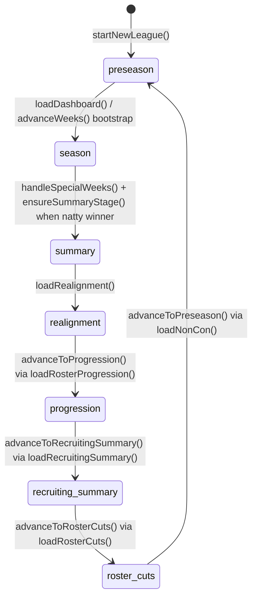

# Season State Machine

## Scope

Defines the authoritative lifecycle stage graph, transition guards, side effects, and stage-gated loader behavior.

## Entry Points

- Initial stage creation: `startNewLeague(...)`.
- Season advancement: `advanceWeeks(destWeek)` and postseason gate `handleSpecialWeeks(...)`.
- Offseason stage loaders: `loadRealignment()`, `loadRosterProgression()`, `loadRecruitingSummary()`, `loadRosterCuts()`, `loadNonCon()`.
- Stage transition helpers: `advanceToProgression()`, `advanceToRecruitingSummary()`, `advanceToRosterCuts()`, `advanceToPreseason()`.

## Core Types and Stores

- Stage holder: `LeagueState.info.stage`.
- Week/year cursor: `LeagueState.info.currentWeek`, `currentYear`, `lastWeek`.
- Postseason transition dependency: `LeagueState.playoff` and natty game winner state in `games` store.
- Persistence location for state machine: `league/current` record in IndexedDB.

## Execution Flow

1. **Initialization**
- `startNewLeague()` sets `info.stage = 'preseason'`, seeds week/year, settings, playoff scaffold, and counters.

2. **Preseason to season enablement**
- `loadDashboard()` sets stage to `season` when schedule is not built and initializes sim game records.
- `advanceWeeks()` also enforces `season` bootstrap if schedule/sim are not initialized.

3. **Season progression and summary transition**
- `advanceWeeks()` simulates week-by-week and invokes `handleSpecialWeeks()`.
- `handleSpecialWeeks()` schedules postseason rounds/bowls by format; `ensureSummaryStage()` transitions to `summary` only after natty has a winner.

4. **Summary to offseason progression**
- `loadRealignment()` transitions `summary -> realignment` and applies prestige updates.
- `loadRosterProgression()` invokes `advanceToProgression()` to transition `realignment -> progression`.
- `loadRecruitingSummary()` invokes `advanceToRecruitingSummary()` to transition `progression -> recruiting_summary`.
- `loadRosterCuts()` invokes `advanceToRosterCuts()` to transition `recruiting_summary -> roster_cuts`.

5. **Offseason to next preseason**
- `loadNonCon()` checks `stage === 'roster_cuts'` and invokes `advanceToPreseason()`.
- `advanceToPreseason()` applies cuts/starters/rating recalculation, resets season data, and sets `stage = 'preseason'`.

## Invariants and Constraints

- Transition helpers are stage-guarded; mismatch returns false/no-op.
- `summary` transition is postseason-result dependent, not purely week-count dependent.
- Loader invocation order matters in offseason; loaders are used as transition triggers.
- `preseason` reset preserves league identity/settings while resetting season counters/artifacts.

## Failure/Edge Cases

- If natty is not created or not completed, `summary` transition is deferred.
- If offseason loader is opened out of order, guard functions prevent illegal stage jump.
- `loadNonCon()` silently skips preseason transition unless currently in `roster_cuts`.
- Postseason creation functions short-circuit when round game IDs already exist (idempotent scheduling protection).

## Transition Table

| From | To | Trigger | Guard | Side Effects |
|---|---|---|---|---|
| `none` | `preseason` | `startNewLeague()` | n/a | Initializes league info/settings/counters, non-con schedule seed, persists league |
| `preseason` | `season` | `loadDashboard()` or `advanceWeeks()` bootstrap path | `!scheduleBuilt` or `!simInitialized` path | Builds schedule, initializes game records, sets `scheduleBuilt`, `simInitialized`, stage |
| `season` | `summary` | `handleSpecialWeeks()` -> `ensureSummaryStage()` | natty exists and has `winnerId` | Sets stage to `summary`; finalizes postseason rankings |
| `summary` | `realignment` | `loadRealignment()` | `league.info.stage === 'summary'` | Applies prestige changes; persists stage/settings context |
| `realignment` | `progression` | `advanceToProgression()` via `loadRosterProgression()` | stage must be `realignment` | Applies realignment/playoff settings and advances stage |
| `progression` | `recruiting_summary` | `advanceToRecruitingSummary()` via `loadRecruitingSummary()` | stage must be `progression` | Applies progression + recruiting cycle; persists players/league |
| `recruiting_summary` | `roster_cuts` | `advanceToRosterCuts()` via `loadRosterCuts()` | stage must be `recruiting_summary` | Advances stage only |
| `roster_cuts` | `preseason` | `advanceToPreseason()` via `loadNonCon()` | stage must be `roster_cuts` | Applies cuts, sets starters, recalculates ratings, resets season data, reinitializes non-con artifacts |

## Source Map (file/function references)

- `src/domain/league/loaders/season/startNewLeague.ts`: initialization to `preseason`
- `src/domain/league/loaders/season/loadDashboard.ts`: preseason bootstrap to `season`
- `src/domain/sim/orchestrator.ts`: `advanceWeeks` season advancement path
- `src/domain/sim/postseason.ts`: `handleSpecialWeeks`, postseason scheduling, summary gate logic
- `src/domain/league/loaders/offseason.ts`: `loadRealignment`, `loadRosterProgression`, `loadRecruitingSummary`, `loadRosterCuts`
- `src/domain/league/loaders/season/loadNonCon.ts`: `roster_cuts` to `preseason` call path
- `src/domain/league/stages.ts`: `advanceToProgression`, `advanceToRecruitingSummary`, `advanceToRosterCuts`, `advanceToPreseason`
