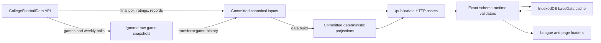

# Static Data System

This document is the authoritative guide to the repository's static data. It
defines which files are sources, which files are projections, how provider data
enters the repository, how runtime loading and caching work, and the required
maintenance workflows.

## Design Goals

The static-data system follows five rules:

1. Commit only data the application needs or data required to rebuild it.
2. Keep one canonical representation for each fact.
3. Generate every redundant runtime projection deterministically.
4. Validate untrusted JSON before it becomes a domain type.
5. Use program and conference display names as the canonical cross-file IDs.

There are no legacy loaders, fallback schemas, raw API archives in Git, or
repair-on-read behavior.

## Data Flow



Provider responses are never trusted directly. Season-result ingestion
converts responses immediately into the canonical season contract. Detailed
game ingestion temporarily stores raw snapshots outside Git, then transforms
them into canonical historical-game seasons.

## Ownership Map

### Canonical committed inputs

These files contain source facts and must not be reconstructed from another
committed asset.

| Path | Owner | Purpose |
| --- | --- | --- |
| `public/data/teams.json` | Maintainer | Stable program catalog and visual/location metadata |
| `public/data/conferences.json` | Maintainer | Conference display-name catalog |
| `public/data/rivalries.json` | Maintainer | Rivalry pairs, names, preferred weeks, and neutral sites |
| `public/data/names.json` | Maintainer | Weighted player first- and last-name pools |
| `public/data/states.json` | Maintainer | Weighted recruiting-origin distribution |
| `public/data/prestige_config.json` | Maintainer | Target percentage for each prestige tier |
| `public/data/seasons/YYYY.json` | Maintainer, starting-prestige generator, plus CFBD season-result ingestion | Season topology, generated prestige, playoff rules, and final results |
| `public/data/historical-games/YYYY.json` | CFBD game-history transformation | Canonical detailed games for one completed season |

`public/logos/teams/<canonical team>.png` is a companion asset rather than JSON,
but every program referenced by a season must have one.

### Generated committed runtime assets

These files are redundant projections. Never edit them manually; run `npm run
data:build`.

| Path | Derived from | Runtime purpose |
| --- | --- | --- |
| `public/data/seasons/index.json` | Season filenames | Descending new-league season choices |
| `public/data/history.json` | Completed season files | Compact team history and prior-season baseline |
| `public/data/betting_odds.json` | Fixed-seed simulation | Rating-difference odds lookup |
| `public/data/historical-games/index.json` | Canonical historical-game seasons | Available detailed-game years |
| `public/data/historical-games/by-team/*.json` | Canonical historical-game seasons plus team catalog | Small team-specific schedule lookups |

Generated files deliberately contain no timestamps. Stable ordering,
serialization, and a trailing newline make exact byte comparison meaningful.

### Disposable local inputs

`fetch:game-history` writes raw CFBD games, rankings, and a local manifest under
`.artifacts/game-history/raw/`. The directory is ignored by Git. It supports a
resumable fetch/transform workflow but is not a repository source of truth and
may be deleted after transformation.

Season-result ingestion does not keep raw responses at all.

## Canonical Identifiers

Program display names are relational keys, not presentation-only strings. The
same spelling must be used in the team catalog, seasons, rivalries, history,
and historical games. Conference keys follow the same rule across
`conferences.json` and season topology.

CFBD spelling belongs only at the ingestion boundary. `scripts/cfbd_team_names.ts`
maps provider variants such as `TCU`, `UAB`, `Hawai'i`, and `San José State` to
canonical repository names. Both ingestion pipelines use this shared
normalizer. Unknown names pass through unchanged so validation can either
accept a legitimate opponent or identify an unmapped supported program.

When a provider changes a supported program's name:

1. Add the provider spelling to `scripts/cfbd_team_names.ts`.
2. Add a representative case to `scripts/cfbd_team_names.test.ts`.
3. Run the affected ingestion pipeline test and full data check.

Do not add provider aliases to `src/`; runtime code knows only canonical names.

## Canonical File Contracts

The cohesive TypeScript contracts live in `src/types/baseData.ts`. Runtime and
offline validators live in `src/domain/baseDataValidation.ts`,
`src/domain/seasonDataValidation.ts`, `src/domain/historicalGames.ts`, and
`src/domain/rivalryData.ts`.

Validators reject extra fields as well as missing or malformed fields. JSON
casts are not a validation mechanism.

### Program catalog

`teams.json` contains one `teams` object keyed by canonical program name. Each
program has exactly:

- `mascot`, `abbreviation`, `city`, `state`, and `stadium`: nonempty strings;
- `colorPrimary` and `colorSecondary`: six-digit hex colors;
- `floor` and `ceiling`: prestige integers from 1 through 7, with
  `floor <= ceiling`.

Generated season prestige must also remain inside each program's catalog
bounds.

### Conference catalog

`conferences.json` maps each nonempty canonical conference key to its nonempty
display name. Season independents use the reserved runtime label
`Independent`; they do not appear as a conference topology object.

### Rivalries

`rivalries.json` contains exactly a `rivalries` array. Every entry has two
distinct known team names and may specify:

- a nonempty `name`;
- a preferred `week` from 1 through 14;
- `site: { "type": "neutral", "venue"?: string }`.

A team pair may occur only once, regardless of pair order.

### Names and states

`names.json` has exactly `profiles` and `positionWeights`. Every dynamically
named profile contains nonempty `first` and `last` arrays of
`{ "name": string, "weight": number }`; names are unique within each array
case-insensitively, and weights are positive finite numbers. `positionWeights`
contains every active roster position. Each position contains exactly the
declared profile IDs with finite nonnegative weights totaling 100.

The committed catalog uses the Social Security Administration's
[national baby-name data](https://www.ssa.gov/oact/babynames/limits.html) and
the US Census Bureau's 2020
[name tables](https://www.census.gov/topics/population/genealogy/data/2020_names.html).
The first-name catalog is the 1,000 most frequent male names summed across
birth years 2000 through 2008. Census group shares then distribute each name's
cohort birth count across the five profiles: `black`, `white`, `hispanic`,
`asianPacific` (Asian, Native Hawaiian, and Pacific Islander), and `other`
(American Indian, Alaska Native, and multiracial). All 1,000 names match the
full Census first-name table, so the committed data uses no inferred fallback
shares. Surnames remain the Census top 1,000 weighted within each profile.
Profile membership is not exclusive: a name appears in multiple profiles with
different frequency-derived weights.

For first names, the raw profile weight is the cohort birth count multiplied by
the name's Census group share. Surname weights use Census group counts
directly. Each pool's raw values are square-root compressed to integer weights
from 1 through 10. This preserves the popularity signal without letting a few
very common names dominate generated rosters. Position profile percentages are
deliberately small, maintainer-owned estimates rather than a claim about a
player's identity; the generated profile is never persisted. Changing the
source snapshot, cohort years, or weighting recipe requires regenerating the
whole static file, validating it, and incrementing `STATIC_DATA_VERSION`.

`states.json` contains exactly the 50 postal state codes plus `DC`. Every
weight is finite and nonnegative, and their total must be positive. The values
are relative weights; they do not need to total 100.

### Prestige distribution

`prestige_config.json` contains exactly keys `1` through `7`. Values are finite
percentages from 0 through 100 and must total 100. Starting and runtime
prestige use it for the same league-relative raw tier bands. Program bounds may
move the final tier distribution away from those raw percentages, so
`data:check` verifies the exact generated assignments instead of applying an
approximate final-share tolerance. [Program Prestige](../systems/program-prestige.md)
owns the calculation and bounds behavior.

### Seasons

Each `public/data/seasons/YYYY.json` is the complete canonical definition of a
supported starting season:

```json
{
  "year": 2026,
  "playoff": {
    "teams": 12,
    "conf_champ_top_4": false,
    "conf_champ_autobids": 5
  },
  "conferences": {
    "Big Ten": {
      "games": 9,
      "teams": {
        "Indiana": 5,
        "Ohio State": 7
      }
    }
  },
  "independents": {
    "Notre Dame": 7
  },
  "results": null
}
```

The contract is:

- `year` matches the filename and requested runtime year.
- `playoff.teams` is 2, 4, or 12.
- Two- and four-team formats use zero autobids and disable top-four conference
  champion seeding.
- Autobids are integers from 0 through 10. Top-four champion seeding in a
  12-team format requires at least four autobids.
- A conference's `games` is an integer from zero through the lesser of 12 and
  one fewer than its member count.
- Every team belongs to exactly one conference or the independents object.
- The number beside a team is its generated starting prestige from 1 through
  7. It is materialized for runtime loading and must not be hand-tuned.
- `results: null` means scheduled. Only the newest season may be scheduled.
- A completed `results` object covers the exact active-team universe.
- Every result contains exactly `rank`, `wins`, and `losses`; records are
  nonnegative integers.
- Results are stored in ranking order. The first entry has rank 1, the second
  rank 2, and so on through a unique contiguous `1..N` field.

The topology is authored locally even when results come from CFBD. Provider
conference membership never overwrites the local season definition.

### Canonical historical-game seasons

Each `public/data/historical-games/YYYY.json` contains `{ "year", "games" }`.
Every game stores the CFBD source ID, app week, regular/postseason type, teams,
scores, AP ranks at game time, neutral-site flag, optional venue and name, and
a resolved display label.

Important invariants include:

- years start at 2000 and match the filename;
- weeks are 1 through 19;
- ranks are 0 for unranked or 1 through 25;
- source IDs and matchup-result fingerprints are unique within the season;
- games are ordered by week, regular before postseason within a week, then
  source ID;
- the season is completed and every active program with a nonzero canonical
  record appears in at least one game;
- a retained game may include an unsupported lower-division opponent, but at
  least one participant must be a supported program.

The CFBD 2020 response omits New Mexico State's two spring 2021 games even
though the canonical season result is 1-1. `data:check` carries one explicit
coverage exception for that provider gap; Connecticut and Old Dominion need no
exception because their canonical 2020 records are 0-0.

This representation is canonical after transformation. The by-team files are
projections and do not replace it.

## Generated Asset Contracts

### Season index

`seasons/index.json` is `{ "years": string[] }`. It exactly matches the
four-digit season filenames in strictly descending order. Scheduled and
completed seasons both appear.

### Compact history

`history.json` contains:

- `years`: completed seasons in descending order;
- `conf_index`: canonical conference name to compact nonnegative ID;
- `teams`: canonical team name to history rows.

A history row is the integer tuple:

```text
[year, conferenceId, rank, wins, losses, prestige]
```

Only seasons with non-null results contribute rows. The app loads this file as
the initial real-history baseline, then mutates the cached `history` value as a
dynasty completes simulated seasons.

### Betting odds

`betting_odds.json` is generated by the production simulation engine with:

- seed `20260812`;
- 1,000 games at each rating difference;
- rating differences `0..100`;
- 101,000 simulations in total.

Each row contains complementary favorite/underdog win probabilities and the
corresponding spreads and moneylines. The generator constants and exact key
range are part of validation, so changing them is an explicit data-contract
change.

### Historical-game index and team projections

`historical-games/index.json` identifies the source as
`CollegeFootballData.com` and lists canonical historical season files in
strictly ascending order.

`historical-games/by-team/<canonical team>.json` contains every detailed game
for that supported program in reverse chronological order. A projection stores
only the source ID, year, week, opponent, scores, and label required by team and
game loaders. The builder replaces the entire directory so removed programs or
games cannot leave stale files.

## Deterministic Build and Check

### Build

```text
npm run data:build
```

`data:build` does not access the network or ignored raw snapshots. It first
constructs and validates all candidates in memory, then writes:

1. `seasons/index.json`;
2. `history.json`;
3. `betting_odds.json`;
4. `historical-games/index.json`;
5. the complete `historical-games/by-team/` directory.

Individual JSON destinations use same-directory temporary files and atomic
renames. The by-team directory is staged and replaced as a whole.

### Check

```text
npm run data:check
```

`data:check` performs no writes and no network requests. It:

- exact-schema validates every committed JSON family;
- verifies that season filenames, embedded years, and the season index agree;
- allows null results only on the newest season;
- checks program, conference, rivalry, and logo references;
- checks season prestige bounds and exact generator agreement;
- requires historical games only for completed seasons and verifies program
  coverage;
- regenerates every derived candidate in memory;
- compares generated files byte for byte;
- detects missing and extra by-team projections.

The odds regeneration intentionally makes this command slower than an ordinary
schema check. A stale generated-file error should be fixed with `npm run
data:build`, followed by another `npm run data:check`.

## Runtime Loading, Validation, and Caching

`src/db/baseData.ts` is the runtime boundary. `getValidatedBaseData()` uses the
same process for every asset:

1. Look for the logical key in IndexedDB's `baseData` store.
2. If cached, validate the cached value and return it.
3. Otherwise fetch the `/data/...` JSON asset.
4. Validate the fetched value.
5. Cache and return the validated value.

Malformed cached data is not trusted, normalized, or silently replaced.
Malformed network data is never cached as a domain value.

Important cache keys are:

| Data | Key |
| --- | --- |
| Season index | `seasons:index` |
| Season | `seasons:YYYY` |
| Program/conference/rivalry catalogs | `teams`, `conferences`, `rivalries` |
| Names, states, prestige, odds | `names`, `states`, `prestige_config`, `betting_odds` |
| History baseline/save history | `history` |
| Historical-game index | `historical-games:index` |
| Historical-game season | `historical-games:YYYY` |
| Team game projection | `historical-games:team:<canonical team>` |

`STATIC_DATA_VERSION` in `src/db/baseData.ts` is the manual public-data cache
epoch. On application initialization, a version mismatch deletes every cached
static value except mutable `history`, then records the new epoch. Increment it
once before releasing any change to a public data asset that an installed
client may already have cached.

Starting a new league calls `clearBaseDataCache()`, which clears even mutable
history and causes a fresh `history.json` baseline to load. This is separate
from `DB_VERSION`, the destructive schema epoch for all persisted save stores.

## Provider Ingestion

Both network commands require `CFBD_API_KEY` in the ignored root `.env` file.
The shared request helper sends bearer authentication, requires an array JSON
response, reports the year and endpoint in errors, and retries HTTP 429 up to
four total attempts using `Retry-After` or bounded backoff.

### Final season results

```text
npm run fetch:season-results -- --year 2025
npm run fetch:season-results -- --year 2025 --refresh
npm run fetch:season-results -- --year 2025 --check
npm run fetch:season-results -- --all --refresh
npm run fetch:season-results -- --all --check
```

Exactly one of `--year YYYY` and `--all` is required. `--refresh` and `--check`
are mutually exclusive, and `--all` requires one of them.

For each year, the command concurrently fetches:

- the greatest-week postseason poll named exactly `AP Top 25`;
- SRS ratings (`SP+` for the entire 2020 field);
- total-season records.

It processes years sequentially to limit API pressure. The canonical local
season supplies the active teams and conference assignments. Provider teams
outside that universe are ignored.

The final order is deterministic:

1. Sort final AP entries by published rank, descending power rating, then
   canonical name.
2. Keep exactly 25, resolving a tied cutoff deterministically.
3. Sort every remaining active team by descending power rating, then name.
4. Concatenate both groups and assign ordinal ranks `1..N`.
5. Attach total wins and losses.

Conflicting duplicates, missing target teams, unmapped AP teams, invalid
ratings or records, and ties fail the command. For 2020, Connecticut and Old
Dominion receive explicit 0-0 records because CFBD has no record rows for their
canceled seasons.

Mode behavior:

| Mode | Behavior |
| --- | --- |
| Single year, no mode | Populate a scheduled season and refuse to overwrite non-null results |
| `--refresh` | Regenerate and replace results |
| `--check` | Fetch, generate in memory, and compare without writing |
| `--all --refresh` | Fetch every completed season before atomically replacing the complete seasons directory |
| `--all --check` | Compare every completed season and the index without writing |

The command changes only `results`; local topology, prestige, and playoff rules
remain intact.

### Detailed historical games

Detailed games use two explicit stages:

```text
npm run fetch:game-history -- --year 2025 --refresh
npm run transform:game-history -- --year 2025
```

`fetch:game-history` is network-only ingestion. It fetches regular-season
games, postseason games, and weekly rankings concurrently for a year, then
atomically updates that year's ignored snapshot and manifest. Without
`--refresh`, an existing complete snapshot is skipped. Omitting `--year`
processes all completed bundled seasons sequentially.

`transform:game-history` is offline. It validates the raw manifest, normalizes
provider team names, removes unfinished games, resolves AP ranks and display
labels, collapses duplicate provider results, and writes canonical historical
seasons plus their index and by-team projections. When CFBD omits an AP poll
for a game week, the transform carries forward the most recent prior poll; it
still fails if no current or prior poll exists. A selected year preserves other
committed historical seasons. Omitting `--year` requires snapshots for every
completed bundled season. The complete `historical-games/` directory is staged
and atomically replaced.

Detailed game history is optional for a supported season. Add it only when the
product should expose that season's real schedules and game results.

## Maintenance Workflows

### Edit an existing canonical input

1. Edit only the canonical file.
2. If topology, results, bounds, or the tier distribution changed, run
   `npm run generate:starting-prestige -- --write`.
3. Run `npm run data:build`.
4. Run `npm run data:check`.
5. Run tests and typecheck appropriate to the affected domain.
6. Review generated diffs for plausible scope.
7. Increment `STATIC_DATA_VERSION` once before release.

Do not hand-edit a projection or an embedded starting-prestige value to make a
check pass.

### Add a scheduled season

1. Copy the newest season only as a structural starting point.
2. Create `public/data/seasons/YYYY.json` with the new year, exact topology,
   valid in-bounds prestige placeholders, playoff configuration, and
   `results: null`.
3. Confirm it is the newest season and the only scheduled season.
4. Run:

```text
npm run generate:starting-prestige -- --write
npm run data:build
npm run data:check
```

5. Test new-league creation and historical realignment behavior if topology or
   postseason rules changed.
6. Increment `STATIC_DATA_VERSION` once before release.

### Complete a season

After the final AP poll and records are available:

```text
npm run fetch:season-results -- --year YYYY
npm run generate:starting-prestige -- --write
npm run data:build
npm run fetch:season-results -- --year YYYY --check
npm run data:check
```

The mode-less command is intentional here: it proves the season was scheduled
and prevents accidental replacement of previously accepted results. Use
`--refresh` only when correcting an already completed season.

Optionally add detailed games:

```text
npm run fetch:game-history -- --year YYYY
npm run transform:game-history -- --year YYYY
npm run data:build
npm run data:check
```

Increment `STATIC_DATA_VERSION` once for the complete released public-data
change, not once per command.

### Refresh all provider-backed results

Use this only when deliberately accepting a provider-wide data refresh:

```text
npm run fetch:season-results -- --all --refresh
npm run generate:starting-prestige -- --write
npm run data:build
npm run fetch:season-results -- --all --check
npm run data:check
```

Review every season diff. Provider revisions are real input changes, not
formatting noise.

## Verification Matrix

| Change | Minimum focused verification |
| --- | --- |
| Canonical catalog or season topology | `data:build`, `data:check`, relevant league tests, `typecheck` |
| Season results | Single-year CFBD `--check`, `data:check`, history/league tests |
| Historical games | Transform tests, `data:build`, `data:check`, schedule/game loader tests |
| Validator or runtime loader | Validator and `src/db/baseData.test.ts`, `data:check`, `typecheck` |
| Generator logic or simulation odds | Generator tests, two clean builds or `data:check`, affected simulation tests |
| Provider aliases or request behavior | CFBD helper and both ingestion-boundary tests |

Use [Validation and Test Strategy](../operations/validation-and-test-strategy.md)
for the complete repository check and cross-system scenarios.

`fetch:season-results -- --all --check` is an additional network-backed
provider audit, not part of the offline repository check.

## Troubleshooting

### “Generated content is stale”

Run `npm run data:build`, inspect the resulting diff, then rerun `npm run
data:check`. If the diff is unexpected, fix the canonical input or generator;
do not patch the projection.

### A provider team is missing or unknown

First decide whether it is an active canonical program, a legitimate
lower-division opponent, or a provider spelling variant. Only spelling
variants belong in `scripts/cfbd_team_names.ts`. The season topology—not CFBD
conference data—decides the active universe.

### A scheduled-season check fails

Only the numerically newest season may use `results: null`. All older seasons
must have exact full-field results.

### A logo or catalog reference fails

Use the canonical team or conference spelling from the season. Add missing
program metadata and `public/logos/teams/<team>.png`; do not introduce a second
identifier.

### The app still shows old public data

For a release, verify that `STATIC_DATA_VERSION` was incremented. During local
development, starting a new league clears the complete base-data cache. A
schema `DB_VERSION` bump is not the remedy for ordinary public-data changes.

### `data:check` is slow

This is expected because it reruns the fixed 101,000-game odds generation in
memory. It remains offline and write-free.

## Source Map

- Contracts: `src/types/baseData.ts`
- Shared catalog/history/odds validators: `src/domain/baseDataValidation.ts`
- Season validator: `src/domain/seasonDataValidation.ts`
- Rivalry validation: `src/domain/rivalryData.ts`
- Historical-game validation and projections: `src/domain/historicalGames.ts`
- Runtime loading and caching: `src/db/baseData.ts`
- Script typechecking: `tsconfig.scripts.json`
- Deterministic builder: `scripts/data_build.ts`
- Starting-prestige generator: `scripts/generate_starting_prestige.ts`
- Repository-wide checker: `scripts/data_check.ts`
- Season-result CLI and transformation: `scripts/fetch_season_results.ts`,
  `scripts/season_results_pipeline.ts`
- Shared CFBD request and name normalization: `scripts/cfbd.ts`,
  `scripts/cfbd_team_names.ts`
- Detailed-game fetch and transform: `scripts/fetch_game_history.ts`,
  `scripts/game_history_pipeline.ts`, `scripts/transform_game_history.ts`
- History and odds builders: `scripts/build_history.ts`,
  `scripts/build_betting_odds.ts`
- Shared paths and stable JSON serialization: `scripts/data_files.ts`
