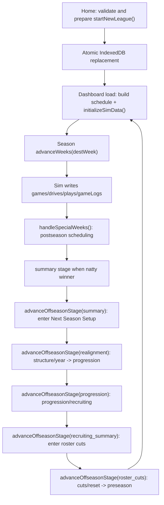

# System Overview

## Scope

Defines the runtime architecture for CFB Sim at the system boundary level: browser-only execution, persistence boundaries, domain orchestration flow, and UI integration points for season/offseason progression.

## Entry Points

- League creation and initialization: `startNewLeague(...)`.
- Season command and schedule bootstrap: `loadDashboard()` and `advanceWeeks(destWeek)`.
- Offseason lifecycle command: `advanceOffseasonStage(expectedStage)`.
- Next-season configuration command: `updateNextSeasonConfiguration(patch)`.
- Authoritative stage metadata: `STAGES`, `getStageDefinition()`,
  `getStageRoute()`, and `getNextStageDefinition()`.
- Offseason route readers: `loadRealignment()`, `loadRosterProgression()`,
  `loadRecruitingSummary()`, `loadRosterCuts()`, `loadNonCon()`.
- Live game orchestration: `getGamesToLiveSim()`, `prepareInteractiveLiveGame(gameId)`, `finalizeGameSimulation(...)`.

## Core Types and Stores

- Primary in-memory aggregate: `LeagueState` (`info`, `teams`, `conferences`, `settings`, `playoff`, `idCounters`).
- Persistence source of truth: IndexedDB stores `baseData`, `league`, `games`, `drives`, `plays`, `gameLogs`, `players`.
- Core runtime records:
  - Game lifecycle: `GameRecord`, `DriveRecord`, `PlayRecord`, `GameLogRecord`.
  - Roster lifecycle: `PlayerRecord`.

## Execution Flow

1. **Runtime boot and league normalization**
- Loaders use `loadLeagueOrThrow()` / `loadLeagueOptional()`.
- `normalizeLeague()` repairs/derives fields (`startYear`, `rivalryHostSeeds`, postseason settings/playoff structure) before use.

2. **League initialization path**
- Home calls `startNewLeague()` with a typed exact year/team/playoff
  configuration. The command clears/repopulates the base cache, prepares teams,
  conferences, `LeagueState`, rosters, history, and preseason rivalry games,
  then atomically replaces the league and simulation stores. Home navigates to
  `/noncon` only after commit.

3. **Season bootstrap and week simulation path**
- `loadDashboard()` ensures full schedule exists (`buildFullScheduleFromExisting`) and initializes sim data if needed.
- `advanceWeeks()` simulates unplayed weekly games, writes drives/plays/logs/games, updates records/rankings/headlines, runs postseason hooks via `handleSpecialWeeks()`.

4. **Postseason and summary transition path**
- `handleSpecialWeeks()` creates conference championships, playoff rounds, bowls, and natty by configured playoff format.
- `ensureSummaryStage()` transitions `league.info.stage` to `summary` once natty has a winner and finalizes postseason rankings.

5. **Offseason staged transition path**
- `AppNavigation` calls `advanceOffseasonStage(expectedStage)` and navigates
  from its successful result.
- The command dispatches prestige/history, structure/year, progression and
  recruiting, stage-only, or cuts/reset work for the expected boundary. The
  exhaustive stage catalog supplies its persisted destination and route.
- One multi-store IndexedDB transaction rechecks the persisted source stage and
  commits the destination stage last.
- Offseason route loaders are lifecycle-read-only and stage-gated.

6. **UI integration boundary**
- Page loaders in `src/domain/league/loaders/*` expose stage-aware data contracts.
- A small shared navigation-envelope helper supplies the affected offseason
  loaders and the `/settings` compatibility redirect.
- UI actions trigger orchestration functions: `SeasonBanner` ->
  `advanceWeeks()`, `AppNavigation` -> `advanceOffseasonStage()`, and game
  views -> live sim preparation/finalization APIs.

## Invariants and Constraints

- Browser-only runtime; no backend transaction authority is present in this architecture path.
- IndexedDB is authoritative; loaders and orchestrators persist explicitly after state mutation.
- New-league preparation cannot partially replace an existing save; one
  transaction owns all authoritative replacement writes.
- `normalizeLeague()` is a compatibility guard and must run before using loaded league state.
- `scheduleBuilt`/`simInitialized` gate whether the season sim graph has been materialized.
- Stage transitions are guarded by current stage checks in transition helpers.

## Failure/Edge Cases

- Missing league: loaders/orchestrators that require a league throw with start-new-game guidance.
- Stale league schema: normalization backfills missing fields and persists corrected state.
- Postseason scheduling idempotence: postseason creators short-circuit if round IDs already exist.
- Overlap schedules: weekly sim logs warning if a team appears in multiple games in same week; flow continues.

## Source Map (file/function references)

- `src/domain/league/loaders/season/startNewLeague.ts`: `startNewLeague`
- `src/db/newLeagueRepo.ts`: atomic new-league replacement
- `src/domain/league/loaders/season/loadDashboard.ts`: `loadDashboard`
- `src/domain/sim/orchestrator.ts`: `initializeSimData`, `advanceWeeks`, `prepareInteractiveLiveGame`, `finalizeGameSimulation`
- `src/domain/sim/postseason.ts`: `handleSpecialWeeks`, `ensureSummaryStage` (internal), playoff/bowl builders
- `src/domain/league/loaders/loadRealignment.ts`: Next Season Setup contract
- `src/domain/league/loaders/loadAuthoritativeStage.ts`: compatibility redirect
  contract
- `src/domain/league/loaders/navigationEnvelope.ts`: shared navigation envelope
- `src/domain/league/loaders/loadRosterProgression.ts`: progression preview contract
- `src/domain/league/loaders/loadRecruitingSummary.ts`: finalized recruiting results contract
- `src/domain/league/loaders/loadRosterCuts.ts`: automatic roster-cuts preview contract
- `src/domain/league/loaders/offseason.ts`: summary and awards contracts
- `src/domain/league/loaders/season/loadNonCon.ts`: read-only preseason page contract
- `src/domain/league/stages.ts`: guarded offseason transition command
- `src/constants/stages.ts`: exhaustive labels, routes, and next-stage catalog
- `src/pages/AuthoritativeStageRedirect.tsx`: history-replacing `/settings`
  compatibility route
- `src/domain/rosterConfig.ts`: position order, caps, and starter counts
- `src/domain/rosterCuts.ts`: shared deterministic cut selection, preview, and application
- `src/domain/league/historicalData.ts`: historical source resolution
- `src/domain/league/nextSeasonPreview.ts`: side-effect-free preview building
- `src/domain/league/nextSeasonConfiguration.ts`: settings mapping, validation,
  and stage-gated update command
- `src/db/offseasonRepo.ts`: atomic transition commit and conflict guards
- `src/domain/league/leagueStore.ts`, `src/domain/league/normalize.ts`: load normalization boundary
- `src/components/layout/SeasonBanner.tsx`: season advance UI trigger
