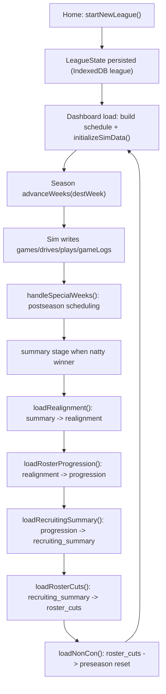

# System Overview

## Scope

Defines the runtime architecture for CFB Sim at the system boundary level: browser-only execution, persistence boundaries, domain orchestration flow, and UI integration points for season/offseason progression.

## Entry Points

- League creation and initialization: `startNewLeague(...)`.
- Season command and schedule bootstrap: `loadDashboard()` and `advanceWeeks(destWeek)`.
- Offseason lifecycle loaders: `loadRealignment()`, `loadRosterProgression()`, `loadRecruitingSummary()`, `loadRosterCuts()`, `loadNonCon()`.
- Live game orchestration: `getGamesToLiveSim()`, `prepareInteractiveLiveGame(gameId)`, `finalizeGameSimulation(...)`.

## Core Types and Stores

- Primary in-memory aggregate: `LeagueState` (`info`, `teams`, `conferences`, `settings`, `playoff`, `idCounters`).
- Persistence source of truth: IndexedDB stores `baseData`, `league`, `games`, `drives`, `plays`, `gameLogs`, `players`.
- Core runtime records:
  - Game lifecycle: `GameRecord`, `DriveRecord`, `PlayRecord`, `GameLogRecord`.
  - Roster lifecycle: `PlayerRecord`.

## Execution Flow

1. **Runtime boot and league normalization**
- Loaders use `loadLeagueOrThrow()` / `loadLeagueOptional()`.
- `normalizeLeague()` repairs/derives fields (`startYear`, `rivalryHostSeeds`, postseason settings/playoff structure) before use.

2. **League initialization path**
- `startNewLeague()` clears prior sim/base cache, builds teams/conferences, initializes `LeagueState`, seeds ID counters, ensures rosters, primes history, initializes preseason non-con schedule, persists league.

3. **Season bootstrap and week simulation path**
- `loadDashboard()` ensures full schedule exists (`buildFullScheduleFromExisting`) and initializes sim data if needed.
- `advanceWeeks()` simulates unplayed weekly games, writes drives/plays/logs/games, updates records/rankings/headlines, runs postseason hooks via `handleSpecialWeeks()`.

4. **Postseason and summary transition path**
- `handleSpecialWeeks()` creates conference championships, playoff rounds, bowls, and natty by configured playoff format.
- `ensureSummaryStage()` transitions `league.info.stage` to `summary` once natty has a winner and finalizes postseason rankings.

5. **Offseason staged transition path**
- `loadRealignment()` transitions `summary -> realignment` and applies prestige updates.
- `loadRosterProgression()` calls `advanceToProgression()` (`realignment -> progression`).
- `loadRecruitingSummary()` calls `advanceToRecruitingSummary()` (`progression -> recruiting_summary`).
- `loadRosterCuts()` calls `advanceToRosterCuts()` (`recruiting_summary -> roster_cuts`).
- `loadNonCon()` calls `advanceToPreseason()` when in `roster_cuts` (`roster_cuts -> preseason`) and resets season data.

6. **UI integration boundary**
- Page loaders in `src/domain/league/loaders/*` expose stage-aware data contracts.
- UI actions trigger orchestration functions: `SeasonBanner` -> `advanceWeeks()`, `Noncon`/`Realignment` pages -> stage loaders/mutations, game views -> live sim preparation/finalization APIs.

## Invariants and Constraints

- Browser-only runtime; no backend transaction authority is present in this architecture path.
- IndexedDB is authoritative; loaders and orchestrators persist explicitly after state mutation.
- `normalizeLeague()` is a compatibility guard and must run before using loaded league state.
- `scheduleBuilt`/`simInitialized` gate whether the season sim graph has been materialized.
- Stage transitions are guarded by current stage checks in transition helpers.

## Failure/Edge Cases

- Missing league: loaders/orchestrators that require a league throw with start-new-game guidance.
- Stale league schema: normalization backfills missing fields and persists corrected state.
- Postseason scheduling idempotence: postseason creators short-circuit if round IDs already exist.
- Overlap schedules: weekly sim logs warning if a team appears in multiple games in same week; flow continues.

## Source Map (file/function references)

- `src/domain/league/loaders/season/startNewLeague.ts`: `startNewLeague`
- `src/domain/league/loaders/season/loadDashboard.ts`: `loadDashboard`
- `src/domain/sim/orchestrator.ts`: `initializeSimData`, `advanceWeeks`, `prepareInteractiveLiveGame`, `finalizeGameSimulation`
- `src/domain/sim/postseason.ts`: `handleSpecialWeeks`, `ensureSummaryStage` (internal), playoff/bowl builders
- `src/domain/league/loaders/offseason.ts`: `loadRealignment`, `loadRosterProgression`, `loadRecruitingSummary`, `loadRosterCuts`
- `src/domain/league/loaders/season/loadNonCon.ts`: offseason-to-preseason transition invocation
- `src/domain/league/stages.ts`: stage guard/transition helpers
- `src/domain/league/leagueStore.ts`, `src/domain/league/normalize.ts`: load normalization boundary
- `src/components/layout/SeasonBanner.tsx`: season advance UI trigger
