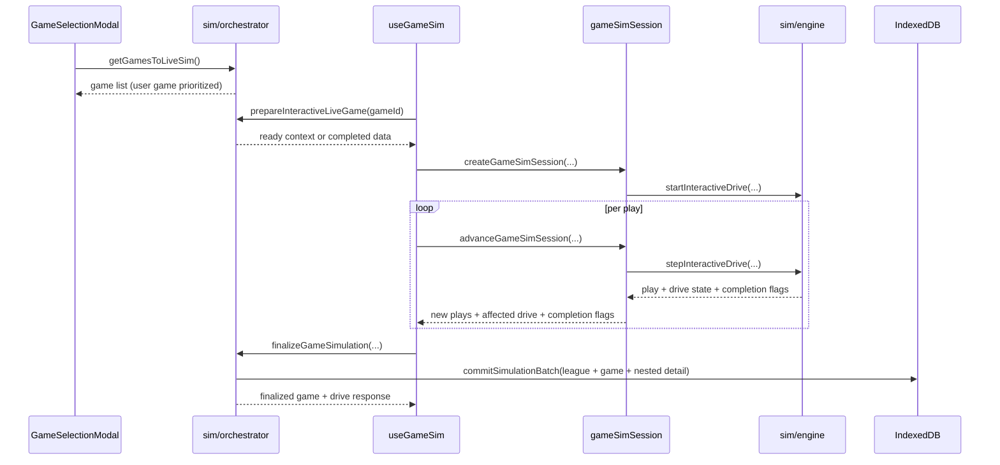

# UI Sim Integration

## Purpose

Explains how the UI coordinates with simulation domain functions for live game selection, interactive stepping, finalization, and data refresh synchronization.

## Ownership

UI sim integration has three layers:

1. **Selection layer**: choose game candidates for current week.
2. **Session layer**: initialize and manage in-memory interactive sim state.
3. **Commit layer**: persist completed results and refresh dependent views.

This allows one game to run interactively while the broader league state remains consistent with the same persistence model used by batch simulation.

## Session Flow

1. **Game selection**
- `GameSelectionModal` calls `getGamesToLiveSim()`.
- Domain prioritizes user-team game first, then sorts others by watchability.
- Selection passes only the chosen game ID. Prepared domain data determines
  whether coaching decisions are available.

2. **Session start**
- `useGameSim.start()` calls `prepareInteractiveLiveGame(gameId)`.
- If game already complete, the hook loads its nested detail and marks the session complete.
- Otherwise, the hook passes the prepared runtime context to
  `createGameSimSession(...)`, which resets transient game state and creates the
  opening possession.

3. **Interactive stepping**
- Session state moves through `preparing`, `ready`, `advancing`, `finalizing`,
  and terminal `complete` or `error` phases.
- `useGameSim.advance('play' | 'drive' | 'game')` serializes UI actions. Play
  and drive scopes call `advanceGameSimSession(...)`; game scope is a guarded
  hook loop over drive advancement so completed drives publish incrementally.
- The session controller translates user-selected typed offensive, defensive,
  special-teams, or try decisions and automatic advancement into repeated
  `stepInteractiveDrive` calls.
- Each step submits one exact call/tempo/timeout instruction and maps the
  resulting `PlayRecord`, including its exact call and participant role IDs,
  into UI play objects and drive cards. Rendered labels, text, timeout events,
  and final box scores consume the same artifact.

4. **Drive transitions and overtime management**
- A touchdown updates the score strip by six, enters a try prompt in the same
  drive, and updates the strip again after a successful conversion.
- `gameSimSession` buffers completed drive/play artifacts, computes the next
  possession, and detects terminal game state.
- It handles the halftime possession flip, first/second-overtime full
  possessions, and third-and-later paired two-point rounds.

5. **Final commit**
- After the session reports completion, the hook calls
  `finalizeGameSimulation(...)` exactly once.
- Domain atomically writes the compact game, nested detail, and league state,
  then returns the final game and drives for UI.
- Hook enters the complete phase only after final persistence succeeds and then
  updates rendered game state with persisted final outputs.

6. **Cross-page sync**
- Closing a successfully completed live simulation dispatches the
  `pageDataRefresh` event.
- The league-calendar navigation owns season advancement, serializes it with
  live-simulation entry, and dispatches `pageDataRefresh` after a successful
  in-season destination or a failed attempt that requires authoritative data.
- Pages using `useDomainData` subscribe and refetch on this event.

## Session Rules

- **Decision gating**:
  - Offensive prompts render when the user team has possession. Defensive
    prompts render before every opponent scrimmage snap without revealing the
    opponent concept; automatic punts, field goals, spikes, and kneels skip the
    prompt.
  - Run concepts (Inside, Outside, Option) and pass concepts (Quick,
    Intermediate, Deep, Screen, Play Action) are one-tap grouped actions;
    Field Goal appears on every regulation scrimmage down; Punt appears only on
    fourth down.
  - Defensive actions are Base, Loaded Box, Coverage, and Pressure. The full
    matchup is revealed in drive history after resolution.
  - After a user-team touchdown, Kick and the existing run/pass concept groups
    select the try. Kick is hidden when two points are mandatory. When the CPU
    chooses two points against the user, the user receives a blind defensive
    intent prompt; CPU extra points need no prompt.
  - Offensive tempo is Auto, Normal, Hurry, or Chew and persists for the current
    possession. A side-aware timeout toggle arms one conditional post-play use
    and clears after the next snap whether or not it is charged.
  - Spike and Kneel appear only in their valid late-half contexts. Any
    deterministic CPU clock-management or special-teams action suppresses the
    blind defensive-intent prompt while leaving the user's timeout control
    available.
- **Serialized advancement**:
  - Play, drive, and game advancement share one guarded action boundary so
    overlapping clicks cannot mutate the same session.
- **Shared core primitives**:
  - Interactive mode uses same underlying engine logic and artifacts as batch mode, reducing divergence.
- **Derived UI state**:
  - Hook computes `displayPlay`, `displayDrive`, possession side, field
    position, quarter/clock, and overtime indicators from session state.
  - The score strip derives remaining timeouts from runtime state. Drive history
    reads regulation labels, overtime periods, durations, tempo, charged-timeout
    separators, clock-event separators, conversion results, and exact overtime
    periods directly from persisted artifacts.
- **Persistence timing**:
  - The framework-free session buffers interactive artifacts in memory. The
    hook commits them on game completion, not after every play.

## Invariants

- `gameId` must resolve to a persisted `GameRecord`.
- Interactive context must keep offense/defense and possession fields synchronized with `SimGame` score/clock state.
- Finalization must execute once per completed game session to avoid duplicate writes.
- UI presentation depends on mapped play/drive records staying in deterministic order.
- UI play projections must preserve the persisted call, participant, and timing
  objects exactly; the UI does not reselect concepts or intent, infer player identities,
  or infer overtime from a regulation timestamp.

## Failure Handling

- If preparation fails (missing game/league), session start aborts.
- Completed games are returned in read-only replay mode without rerunning simulation.
- Auto-drive and auto-end loops include guards to prevent runaway loops in pathological states.
- Unfinished sessions remain in memory and require confirmation before discard.
- The game, detail, news, and league batch is atomic. If later postseason or
  final league follow-up fails after that batch commits, the persisted batch is
  authoritative and the UI requires reload before retry; normal successful and
  cancelled closes do not reload.

## Source Map

- `src/components/sim/GameSelectionModal.tsx`
  - live game discovery and selection UX
- `src/components/sim/useGameSim.ts`
  - React state, serialized `advance('play' | 'drive' | 'game')`, incremental
    UI publication, preparation, and final persistence
- `src/components/sim/gameSimSession.ts`
  - in-memory session state, play/drive advancement, possession transitions,
    artifact buffering, and terminal result finalization
- `src/domain/sim/orchestrator.ts`
  - `getGamesToLiveSim`, `prepareInteractiveLiveGame`, `finalizeGameSimulation`
- `src/domain/sim/drive.ts`
  - `startInteractiveDrive`, `stepInteractiveDrive`
- `src/domain/sim/engine.ts`
  - `buildGameData`, `finalizeGameResult`
- `src/domain/sim/interactive.ts`
  - `buildSimContext`
- `src/domain/sim/ui.ts`
  - UI mapping helpers (`mapPlayRecord`, `buildDriveUi`, decision/header helpers)
- `src/domain/hooks.ts`
  - shared refresh listener via `pageDataRefresh`
- `src/components/layout/AppNavigation.tsx`
  - owns the shared season/offseason action lock and cross-page refresh
- `src/components/layout/SeasonProgressNavigation.tsx`
  - presents desktop week destinations without owning simulation
- `src/components/layout/SeasonProgressMobile.tsx`
  - presents the compact week context and focus-managed destination drawer
