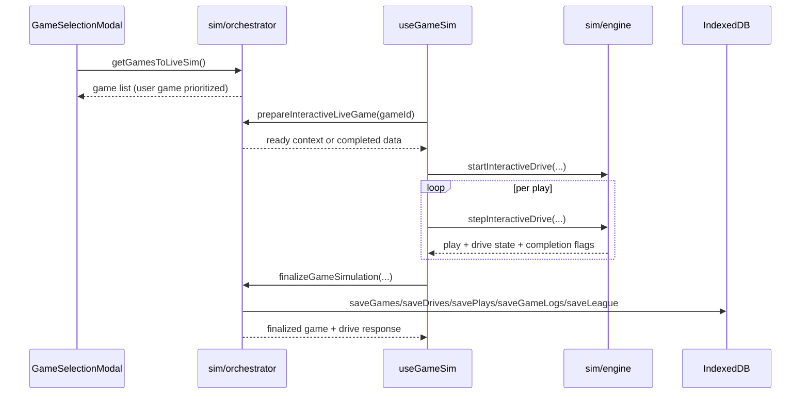

# UI Sim Integration

## Scope

Explains how the UI coordinates with simulation domain functions for live game selection, interactive stepping, finalization, and data refresh synchronization.

## System Model

UI sim integration has three layers:

1. **Selection layer**: choose game candidates for current week.
2. **Session layer**: initialize and manage in-memory interactive sim state.
3. **Commit layer**: persist completed results and refresh dependent views.

This allows one game to run interactively while the broader league state remains consistent with the same persistence model used by batch simulation.

## Execution Flow

1. **Game selection**
- `GameSelectionModal` calls `getGamesToLiveSim()`.
- Domain prioritizes user-team game first, then sorts others by watchability.
- Selection passes only the chosen game ID. Prepared domain data determines
  whether coaching decisions are available.

2. **Session start**
- `useGameSim.start()` calls `prepareInteractiveLiveGame(gameId)`.
- If game already complete, the hook loads its nested detail and marks the session complete.
- Otherwise, it resets in-memory state and hydrates runtime context (`league`, `record`, teams map, starters cache, players map, `SimGame` state).

3. **Interactive stepping**
- Hook creates first drive via `startInteractiveDrive`.
- Session state moves through `preparing`, `ready`, `advancing`, `finalizing`,
  and terminal `complete` or `error` phases.
- Progresses through `stepInteractiveDrive` either by:
  - user decisions (`handleDecision`), or
  - auto stepping (`simulateAutoPlays`, `simulateAutoDrive`, `simulateToEnd`).
- Each step maps `PlayRecord` into UI play objects and updates drive cards.

4. **Drive transitions and overtime management**
- `finalizeDrive` records completed drive artifacts and computes next possession.
- Handles halftime possession flip and overtime possession alternation.
- Continues `advanceToNextDrive` until game completion.

5. **Final commit**
- `finishInteractiveGame` calls `finalizeGameSimulation(...)`.
- Domain atomically writes the compact game, nested detail, and league state,
  then returns the final game and drives for UI.
- Hook enters the complete phase only after final persistence succeeds and then
  updates rendered game state with persisted final outputs.

6. **Cross-page sync**
- Closing a successfully completed live simulation dispatches the
  `pageDataRefresh` event.
- Season advancement also dispatches `pageDataRefresh`.
- Pages using `useDomainData` subscribe and refetch on this event.

## Key Mechanics

- **Decision gating**:
  - User decision prompts only render when current offense is user team and decision mode is enabled.
- **Serialized advancement**:
  - Play, drive, and game advancement share one guarded action boundary so
    overlapping clicks cannot mutate the same session.
- **Shared core primitives**:
  - Interactive mode uses same underlying engine logic and artifacts as batch mode, reducing divergence.
- **Derived UI state**:
  - Hook computes `displayPlay`, `displayDrive`, possession side, field position, quarter/clock, and overtime indicators from interactive state.
- **Persistence timing**:
  - Interactive artifacts are buffered in refs during play and committed on game completion, not after every play.

## Invariants and Constraints

- `gameId` must resolve to a persisted `GameRecord`.
- Interactive context must keep offense/defense and possession fields synchronized with `SimGame` score/clock state.
- Finalization must execute once per completed game session to avoid duplicate writes.
- UI presentation depends on mapped play/drive records staying in deterministic order.

## Failure/Edge Cases

- If preparation fails (missing game/league), session start aborts.
- Completed games are returned in read-only replay mode without rerunning simulation.
- Auto-drive and auto-end loops include guards to prevent runaway loops in pathological states.
- Unfinished sessions remain in memory and require confirmation before discard.
- Finalization failures require application reload to reconcile the separate
  IndexedDB writes; normal successful and cancelled closes do not reload.

## What You Can Observe in the App

- User-team games can present decision prompts while non-user games can be fully auto-run.
- Sim Play, Sim Drive, and Sim to End remain available in both cases.
- Live game score/clock updates in real time and then becomes stable after finalization.
- After closing a successfully persisted live sim, league pages refetch through
  the shared refresh event.

## Source Map (file/function references)

- `src/components/sim/GameSelectionModal.tsx`
  - live game discovery and selection UX
- `src/components/sim/useGameSim.ts`
  - session orchestration (`start`, stepping methods, finalize path)
- `src/domain/sim/orchestrator.ts`
  - `getGamesToLiveSim`, `prepareInteractiveLiveGame`, `finalizeGameSimulation`
- `src/domain/sim/engine.ts`
  - `startInteractiveDrive`, `stepInteractiveDrive`, `buildGameData`, `finalizeGameResult`
- `src/domain/sim/interactive.ts`
  - `buildSimContext`
- `src/domain/sim/ui.ts`
  - UI mapping helpers (`mapPlayRecord`, `buildDriveUi`, decision/header helpers)
- `src/domain/hooks.ts`
  - shared refresh listener via `pageDataRefresh`
- `src/components/layout/SeasonBanner.tsx`
  - emits `pageDataRefresh` after week advancement
