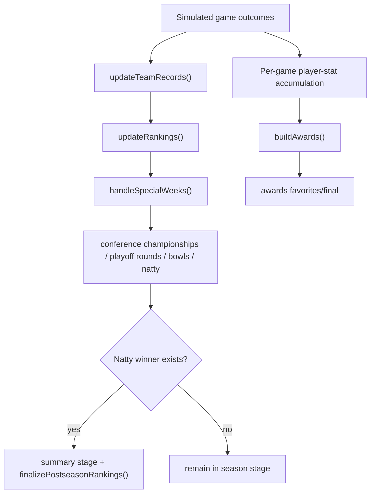

# Rankings, Playoff, and Awards

## Scope

Explains how season outcomes are transformed into ranking movement, postseason structure, and award outcomes.

## System Model

This subsystem has three linked layers:

1. **Ranking layer**: computes records and poll ordering from simulated game results.
2. **Postseason layer**: schedules conference championships, playoff rounds, bowls, and national championship according to format settings.
3. **Awards layer**: aggregates player game logs into award candidate scoring and final selections.

The layers are connected by shared state (`teams`, `games`, `settings`,
`playoff`, and per-game player statistics in `gameDetails`) and run repeatedly
as season weeks advance.

## Execution Flow

1. **Record + ranking updates during progression**
- `updateTeamRecords(...)` consumes simulated games, mutating team W/L splits and strength-of-record components.
- `updateRankings(...)` updates `poll_score` and rank order from inertia + normalized SOR model (with postseason freeze weeks by format).

2. **Postseason scheduling and stage transition**
- `handleSpecialWeeks(...)` dispatches postseason scheduling actions by configured playoff size:
  - conference championships
  - playoff rounds (if applicable)
  - bowls
  - natty.
- Round creators are guarded by existing IDs and winner prerequisites.
- `ensureSummaryStage(...)` promotes stage to `summary` when natty winner exists and applies final postseason ranking normalization.

3. **Playoff presentation path**
- `loadPlayoff()` composes current bracket/projection state, conference champion context, bubble/resume views, and bowl projection/actual mapping.

4. **Awards generation path**
- `loadAwards()` and `loadSeasonSummary()` collect played-game logs for current year.
- `buildAwards(...)` computes favorites/finalists/winners from cached stat aggregates and award-specific scoring heuristics.

## Key Mechanics

- **Strength-of-record influence**:
  - Team strength signal tracks actual wins minus expected wins vs average team baseline.
  - Ranking combines prior-rank inertia with normalized SOR score.
- **Ranking freeze windows**:
  - Certain postseason weeks skip rank recomputation (format-dependent) to stabilize bracket windows.
- **12-team playoff ordering**:
  - Conference champions autobid logic and top-4 champion-bye option alter seed order materially.
- **Postseason idempotence**:
  - Round creators exit when round IDs already populated, preventing duplicate bracket creation.
- **Awards from logs, not roster ratings alone**:
  - Player game logs are aggregated into stat caches (passing/rushing/receiving/defensive/kicking).
  - Award calculators blend production, role/position expectations, and team context.

## Invariants and Constraints

- Ranking and record updates depend on completed game outcomes; unplayed games are excluded.
- Postseason creation uses persistent playoff ID fields; bracket state is durable across reloads.
- Awards only include logs from played games in current year scope.
- Final postseason ranking pass ensures champion/runner-up placement before rank-based score normalization.

## Failure/Edge Cases

- If conference championship game winner is unavailable, champion fallback uses conference standings order.
- If postseason round prerequisites are incomplete, next round creation is deferred.
- If natty does not resolve, stage remains non-summary and summary-specific outputs are withheld.
- Award pages can show empty/fewer outputs early when insufficient games/logs exist.
- Final award winners are copied into the completed season's compact
  `SeasonMemory` before detailed game logs are cleared. Historical finalists
  and generated award prose are not retained.

## What You Can Observe in the App

- Rankings shift as a lagged blend of prior ranking and season signal, rather than resetting entirely week to week.
- Playoff/bowl structures differ significantly between 2/4/12-team settings.
- Conference champions and bracket seeds can diverge from pure AP rank order due to autobid/bye rules.
- Awards become richer later in season as game-log volume grows.

## Source Map (file/function references)

- `src/domain/sim/rankings.ts`
  - `updateTeamRecords`, `updateRankings`, `finalizePostseasonRankings`
- `src/domain/sim/postseason.ts`
  - `handleSpecialWeeks`, postseason round and bowl creators
- `src/domain/league/postseason.ts`
  - postseason week constants and `lastWeek` mapping by playoff size
- `src/domain/league/loaders/playoff.ts`
  - `loadPlayoff` view/projection composition
- `src/domain/league/awards.ts`
  - `buildAwards`, stat cache construction, award calculators
- `src/domain/league/loaders/offseason.ts`
  - `loadAwards`, `loadSeasonSummary` integration and summary-stage handling
