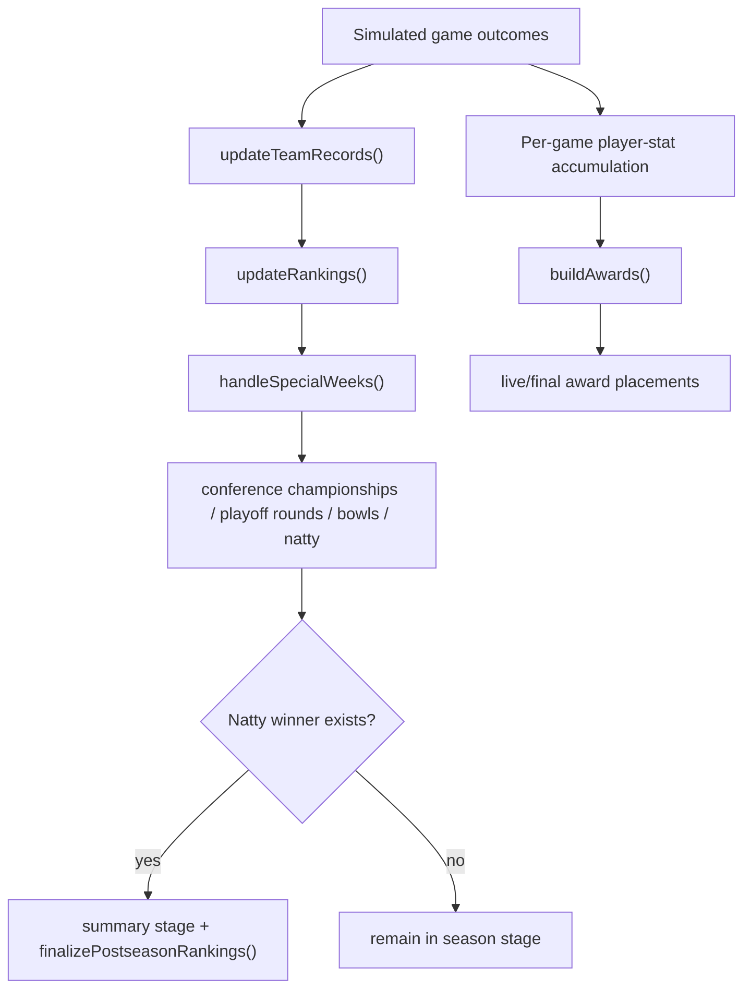

# Rankings, Playoff, and Awards

## Purpose

Explains how season outcomes are transformed into ranking movement, postseason structure, and award outcomes.

## Ownership

This subsystem has three linked layers:

1. **Ranking layer**: computes records and poll ordering from simulated game results.
2. **Postseason layer**: schedules conference championships, playoff rounds, bowls, and national championship according to format settings.
3. **Awards layer**: aggregates player game logs into award candidate scoring and final selections.

The layers are connected by shared state (`teams`, `games`, `settings`,
`playoff`, and per-game player statistics in `gameDetails`) and run repeatedly
as season weeks advance.

## Execution

1. **Record + ranking updates during progression**
- `updateTeamRecords(...)` consumes simulated games, mutating team W/L splits and strength-of-record components.
- Completed regular-season games within one non-independent conference update
  conference W–L; all other completed regular-season games update
  nonconference W–L. Conference championships, bowls, and playoff games update
  the overall record, games played, SOR, and rankings without changing either
  regular-season split.
- `updateRankings(...)` updates `poll_score` and rank order from inertia + normalized SOR model (with postseason freeze weeks by format) and returns the completed mutation for editorial use.
- Week completion is idempotent: `lastRankingsWeek` records only which week was processed, while each team's `last_rank` remains the sole prior-poll snapshot.
- Weeks 1–14 publish a rankings story only for a new No. 1, at least two top-five entrants, or at least five combined Top 25 entries and exits.

2. **Postseason scheduling and stage transition**
- `handleSpecialWeeks(...)` dispatches postseason scheduling actions by configured playoff size:
  - conference championships
  - playoff rounds (if applicable)
  - bowls
  - natty.
- Round creators are guarded by existing IDs and winner prerequisites.
- Conference standings are derived from completed current-year regular-season
  games. Equal conference winning percentages are progressively partitioned
  by a complete tied-group head-to-head mini-table, record against the
  subgroup's common conference opponents, overall regular-season winning
  percentage, and the Week 14 poll. Each later criterion applies only to the
  subgroup still tied, with Team ID reserved as an unreported integrity
  fallback.
- Once Week 14 is complete, standings and poll ranks are frozen with the title
  games. Before that point the standings leader is the projected champion;
  while a title game is pending its first seed remains projected; after the
  game only its winner is the actual champion.
- Final playoff selection publishes one `playoff_field` rankings item in the
  same transaction as the selected seeds, league state, and first playoff
  games for every supported field size. Final selection waits for an actual
  winner from every conference championship, while projection views may use
  projected champions.
- `finalizeCompletedSeasonIfReady(...)` applies final postseason ranking normalization and atomically persists completed-season artifacts with the `summary` stage when a national-championship winner exists.

3. **Playoff presentation path**
- Route-specific postseason loaders compose the bracket, playoff picture,
  résumé comparison, and bowl projection/actual views from shared selection
  context.
- The rankings page projects each team's exact previous-week result and
  current-week matchup; bye weeks remain empty instead of substituting the
  nearest completed or upcoming game.

4. **Awards generation path**
- Live `loadAwards()` projections provide current-year games and logs to `buildAwards(...)`.
- `buildAwards(...)` owns the award window, eligibility, normalized scoring, and live/final placements.
- Season completion calculates final awards once; Season Summary reads the persisted winners and their award-window totals from `SeasonMemory`.

## Selection and Scoring Rules

- **Strength-of-record influence**:
  - Team strength signal tracks actual wins minus expected wins vs average team baseline.
  - Ranking combines prior-rank inertia with normalized SOR score.
- **Ranking freeze windows**:
  - Certain postseason weeks skip rank recomputation (format-dependent) to stabilize bracket windows.
- **12-team playoff ordering**:
  - Conference champions autobid logic and top-4 champion-bye option alter seed order materially.
  - First-round games are played on campus with seeds 5–8 hosting seeds 12–9;
    quarterfinals, semifinals, and the national championship use neutral sites.
- **Postseason idempotence**:
  - Round creators exit when round IDs already populated, preventing duplicate bracket creation.
- **Awards from logs, not roster ratings alone**:
  - Regular-season and conference-championship logs are aggregated into candidate profiles; bowls and playoff rounds do not count.
  - Award-specific production and efficiency components become tied-midrank percentiles on a shared `0–100` scale.
  - A 20% player-rating prior after Game 1 decays to zero after Game 6. Team win percentage affects only 10% of the Heisman score.
  - Logged opportunity thresholds determine eligibility, and the same player may win multiple awards.

## Invariants

- Ranking and record updates depend on completed game outcomes; unplayed games are excluded.
- Postseason creation uses persistent playoff ID fields; bracket state is durable across reloads.
- Every non-independent conference stages exactly one championship between its
  frozen top two teams, created only after the regular season and Week 14 poll
  are complete.
- Awards only include completed regular-season and conference-championship games from the current year.
- Final postseason ranking pass ensures champion/runner-up placement before rank-based score normalization.

## Incomplete-State Handling

- Playoff projections label each conference leader or first-seeded title-game
  participant as projected. Final playoff fields remain unset until every
  title game has an actual winner.
- If postseason round prerequisites are incomplete, next round creation is deferred.
- If natty does not resolve, stage remains non-summary and summary-specific outputs are withheld.
- Award pages can show empty/fewer outputs early when insufficient games/logs exist.
- Final award winners and their numeric award-window totals are copied into the
  completed season's compact `SeasonMemory` when Summary begins. Historical finalists
  and generated award prose are not retained.

## Source Map

- `src/domain/sim/rankings.ts`
  - `updateTeamRecords`, `updateRankings`, `finalizePostseasonRankings`
- `src/domain/sim/postseason.ts`
  - `handleSpecialWeeks`, postseason round and bowl creators
- `src/domain/league/utils/standings.ts`
  - authoritative conference ordering, final snapshot, and champion resolution
- `src/domain/league/postseason.ts`
  - postseason week constants and `lastWeek` mapping by playoff size
- `src/domain/league/loaders/postseason/`
  - route-specific bracket, picture, résumé, and bowl view composition
- `src/domain/league/utils/bowlSelection.ts`
  - authoritative bowl catalog, rotation, classification, and matchup policy
- `src/domain/league/awards.ts`
  - `buildAwards`, stat cache construction, award calculators
- `src/domain/league/awardDefinitions.ts`
  - canonical metadata, ordering, and award slugs
- `src/domain/league/loaders/awards.ts`
  - current-season awards lifecycle gating and projection
- `src/domain/league/loaders/seasonSummary.ts`
  - persisted summary-stage awards projection
