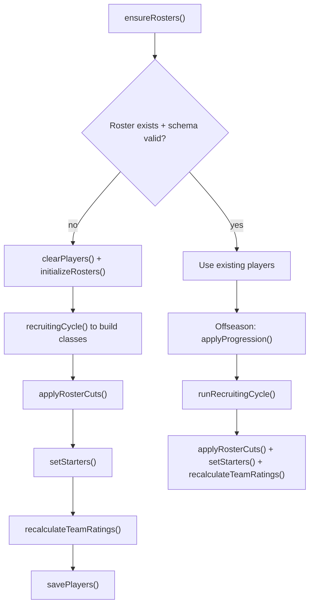

# Roster Progression and Recruiting

## Scope

Explains how player pools are created, progressed, cut, and replenished across seasons, and how those roster changes feed team rating/ranking recalculation.

## System Model

Roster lifecycle is cyclical:

1. **Initialize baseline roster populations** by team/position.
2. **Set starters** from active players.
3. **Run season** with current roster.
4. **Progress classes** (`fr->so->jr->sr`, seniors exit).
5. **Recruit new freshmen** to refill team needs.
6. **Apply roster cuts** to enforce position caps.
7. **Recompute team offense/defense/overall ratings** and ranking order.

This cycle is executed both at initial league creation (multi-class bootstrap) and in each offseason progression pass.

## Execution Flow

1. **Roster presence guard**
- `ensureRosters(league)` checks whether current schema-valid players exist.
- If not, it clears players and runs `initializeRosters(league)`.

2. **Initial roster creation (`initializeRosters`)**
- Builds class targets from `ROSTER` positional totals.
- Executes recruiting cycle repeatedly to synthesize multi-year class stacks.
- Applies cuts, sets starters, computes team ratings, assigns team rankings.
- Persists `players` store.

3. **Offseason progression path**
- `applyProgression(players)` advances class year and updates current rating to year-specific progression rating.
- Seniors are marked inactive.

4. **Recruiting intake**
- `runRecruitingCycle(league, teams, players)` loads names/states distributions and generates recruit pool.
- Assignment process matches recruits to team positional needs and team context.
- Assigned recruits are converted to `PlayerRecord` freshmen using league player ID counter.

5. **Roster enforcement + team recalculation**
- `applyRosterCuts` enforces per-position caps by removing lowest-ranked surplus players.
- `setStarters` chooses top rated active players per position starter count.
- `recalculateTeamRatings` recomputes team offense/defense/overall and resets rank ordering by rating.

## Key Mechanics

- **Position structure source of truth**: `ROSTER` defines starter count and total cap for each position.
- **Player quality generation**:
  - Star-based rating priors (`STARS_BASE`, `STAR_STD_DEV`).
  - Gaussian noise and development trait shape year-by-year rating curve.
- **Recruit assignment model**:
  - Team need is derived from active roster deficits vs position totals.
  - Recruit pool contains position/star/state distribution; assignment uses weighted matching with prestige/randomness effects.
- **Cut ordering**:
  - Sort key prioritizes long-term ceiling (`rating_sr`), then current rating, then class year tie-break.
- **Team rating model**:
  - Starter-only weighted offense/defense aggregates with per-position weights.
  - Overall rating is weighted blend of offense and defense plus noise.

## Invariants and Constraints

- `player.id` allocation must be monotonic via league player counter.
- Inactive players are excluded from starter selection and roster counts.
- Position totals are enforced after recruiting/progression through mandatory cut pass.
- Team ranking after recalculation is rating-sorted and rewritten for all teams.

## Failure/Edge Cases

- Missing states dataset falls back to a synthetic `Unknown` state weight.
- Missing name pools fall back to generic fallback names per generator logic.
- If a team has fewer players than starter requirements at a position, starter assignment fills as many as available.
- Preview and actual cut logic are intentionally aligned (`previewRosterCuts` mirrors cut ordering behavior).

## What You Can Observe in the App

- Offseason progression shifts class composition and visible player ratings year-to-year.
- Recruiting summary introduces new freshmen classes that reflect team need and quality profile.
- Roster cuts remove surplus depth and can alter starter distribution and next-season team ratings.
- Team rank/rating shifts after offseason are often driven by starter turnover and recruiting replacement quality.

## Source Map (file/function references)

- `src/domain/roster.ts`
  - lifecycle: `ensureRosters`, `initializeRosters`, `applyProgression`, `runRecruitingCycle`, `applyRosterCuts`, `setStarters`, `recalculateTeamRatings`, `previewRosterCuts`
  - core constants: `ROSTER`, position weight maps, recruiting constants
- `src/domain/league/stages.ts`
  - stage integration: `advanceToRecruitingSummary`, `advanceToPreseason`
- `src/domain/league/loaders/offseason.ts`
  - loader integration: `loadRosterProgression`, `loadRecruitingSummary`, `loadRosterCuts`
- `src/db/simRepo.ts`
  - player persistence: `getAllPlayers`, `savePlayers`, `getPlayersByTeam`, `clearPlayers`
