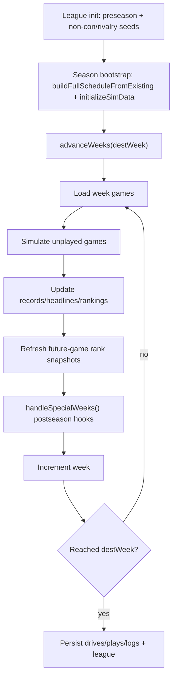

# Scheduling and Week Advancement

## Scope

Explains how season schedules are assembled, how the simulator advances week-to-week, and how postseason games are injected into the calendar for 2/4/12-team formats.

## System Model

Scheduling is a layered process:

1. **Preseason layer**: user-visible non-con slots plus rivalry seeding.
2. **Season layer**: full game graph materialized as `GameRecord`s.
3. **Progression layer**: week loop simulates unplayed games and mutates standings/rankings/headlines.
4. **Postseason layer**: conference championships, playoff rounds, bowls, and natty added at specific weeks or as catch-up actions.

Week advancement is not only “simulate games”; it is also an ordering pipeline that mutates several dependent views (records, rankings, future-game ranks, postseason schedule).

## Execution Flow

1. **Schedule bootstrap / initialization**
- `startNewLeague()` creates preseason state and calls `initializeNonConScheduling()`.
- Non-con rivalry records are created through `buildRivalryGameRecords()` + `createNonConGameRecord()`.
- First season load (`loadDashboard` or `advanceWeeks` when uninitialized) calls `buildFullScheduleFromExisting(...)` and `initializeSimData(...)`.

2. **Preseason non-con edits**
- `scheduleNonConGame(...)` validates slot/opponent availability and writes a single `GameRecord` for the selected week.
- `listAvailableTeams(...)` enforces non-con constraints and excludes teams already used in that week.

3. **Week advancement loop (`advanceWeeks`)**
- While `currentWeek < destWeek`:
  - Load games for `currentWeek` and filter current-year records.
  - Simulate unplayed games only.
  - Aggregate drive/play/log artifacts.
  - Update team records (`updateTeamRecords`), headlines (`generateHeadlines`), and rankings (`updateRankings`).
  - Rewrite current/future game rank snapshots (`rankATOG`, `rankBTOG`) for unplayed games.
  - Persist games and run `handleSpecialWeeks(...)` for postseason scheduling.
  - Increment `currentWeek`.
- After loop, persist all accumulated drives/plays/gameLogs and final league state.

4. **Postseason scheduling hooks**
- `handleSpecialWeeks(...)` selects action by `playoff_teams` and current week:
  - **2-team**: conference championships -> natty (+ bowls).
  - **4-team**: conference championships -> semis (+ bowls) -> natty.
  - **12-team**: conference championships -> round 1 (+ bowls) -> quarters -> semis -> natty.
- Includes catch-up logic when winners are known but expected round creation week was skipped.

## Key Mechanics

- **Conflict handling in schedule builder**:
  - Scheduler attempts conflict-free week assignment.
  - If no conflict-free slot exists, overlap fallback is allowed with warning logs.
- **Non-con safeguards**:
  - Week slot must be open for user team.
  - Opponent cannot already have a game that week.
  - Opponent must satisfy non-con and conference constraints.
- **Ordering effects (critical)**:
  - Sim results mutate records first.
  - Headlines are generated against updated outcomes.
  - Rankings update after record changes.
  - Future unplayed game rank snapshots are updated after rankings shift.
  - Postseason hooks execute after these updates, not before.
- **Year isolation**:
  - Most loaders and progression filters operate on `game.year === currentYear` to avoid cross-year bleed.

## Invariants and Constraints

- `scheduleBuilt` and `simInitialized` must both be true for steady-state week progression.
- `GameRecord.id` uniqueness is enforced through league counters.
- Postseason round creation is idempotent via “already created” guards on playoff IDs.
- Non-game artifact resets (`clearNonGameArtifacts`) intentionally preserve `games` records.

## Failure/Edge Cases

- If schedule is missing at advance time, `advanceWeeks` self-heals by bootstrapping schedule/sim data.
- Teams can appear in multiple weekly games under overlap fallback; progression continues with warning.
- Postseason catch-up paths allow round generation when winner prerequisites are met late.
- If natty winner is absent, summary stage transition is deferred even after postseason scheduling.

## What You Can Observe in the App

- “Advance” can simulate several weeks in one action and then instantly update rankings, standings, and schedules.
- Playoff/bowl pages appear progressively as season reaches postseason thresholds.
- Conference championship and playoff rounds can appear even after non-linear progression, due to catch-up scheduling logic.

## Source Map (file/function references)

- `src/domain/scheduleBuilder.ts`
  - `buildSchedule`, `buildFullScheduleFromExisting`, `applyRivalriesToSchedule`, `listAvailableTeams`, `scheduleNonConGame`
- `src/domain/league/seasonReset.ts`
  - `initializeNonConScheduling`, `buildRivalryGameRecords`, `createNonConGameRecord`, `resetSeasonData`
- `src/domain/league/loaders/season/loadDashboard.ts`
  - season bootstrap path
- `src/domain/league/loaders/season/scheduleNonConGame.ts`
  - user non-con scheduling mutation
- `src/domain/sim/orchestrator.ts`
  - `initializeSimData`, `advanceWeeks`
- `src/domain/sim/postseason.ts`
  - `handleSpecialWeeks`, postseason round creators (`setConferenceChampionships`, `setPlayoffR1`, `setPlayoffQuarter`, `setPlayoffSemi`, `setNatty`, `setBowls`)
- `src/domain/sim/rankings.ts`
  - `updateTeamRecords`, `updateRankings`
