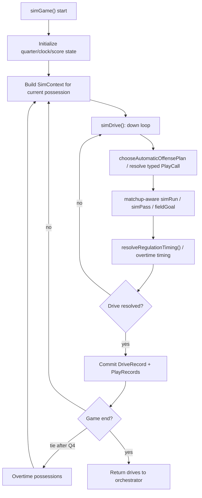
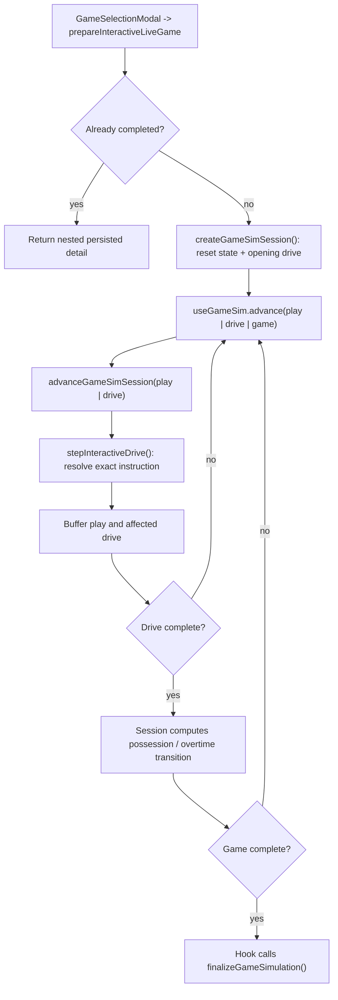

# Simulation Engine

## Purpose

Explains how a single game is simulated in CFB Sim, from possession initialization through finalization and persistence handoff. This covers both batch simulation (`advanceWeeks`) and interactive/live simulation (`useGameSim`).

## Simulation Model

The engine models football as a sequence of drives, and each drive as a sequence of plays. A drive has a single offense/defense pairing, a start field position, and an end condition (score, turnover, punt, half/game end, etc.).

A play combines:

- Situation: down, yards-to-go, field position, score margin, quarter/clock.
- Choice: an exact offensive-concept/defensive-intent matchup, fourth-down
  special-teams call, contextual spike/kneel call, or untimed conversion call.
- Outcome: yards/result event (completion, sack, fumble, touchdown, etc.).
- Participants: exact starter IDs for every applicable offensive, defensive,
  and specialist role.
- Time effect: exact regulation start/end snapshots, elapsed seconds,
  out-of-bounds state, tempo, charged timeout, and clock events; overtime is
  explicitly untimed.

The game result is produced by accumulating drive outcomes into `scoreA/scoreB`,
updating winner/result metadata, and then persisting one nested
`GameDetailRecord`. Only completed play and drive result unions cross that
boundary; transient empty results used while resolving a play or drive are
rejected by persistence.

## Execution

1. **Game hydration and context creation**
- `hydrateGame` converts a persisted `GameRecord` into in-memory `SimGame` shape.
- `SimContext` binds `league`, `game`, `starters`, offense/defense sides, and
  whether clock rules are active. Score margin is always derived from the live
  game score.

2. **Drive simulation loop**
- `simDrive` creates game-local drive/play identities for in-memory orchestration.
- `stepInteractiveDrive` is the single-play entry point for both batch and live
  simulation. It dispatches to focused regulation or try resolution, which
  chooses or accepts a call, runs the outcome, applies timing and scoring,
  formats text, and returns updated state.
- Automatic fourth downs use one explicit field-position/distance policy from
  tuning, with the existing late-game points-needed override. Ordinary
  third-down outcomes pass their exact down into the shared run/pass resolver,
  where positive gains can be calibrated independently without affecting
  fourth downs or two-point tries.
- Batch mode loops over the resolver with `auto`; live mode calls it once per
  user or automatic step.
- A touchdown awards six points and moves the same interactive drive into one
  untimed try phase before the drive completes. Terminal touchdowns may skip a
  try only when one or two points cannot tie or decide the game.
- Loop exits when the drive result and any required try are resolved.

3. **Game-level orchestration**
- `simGame` repeatedly calls `simDrive`, flips possession, manages halftime kickoff reset behavior, and enters overtime if regulation is tied.
- The first two overtime periods use paired possessions from the opponent's
  25. Second-overtime touchdowns require two points. Third-and-later periods
  use paired two-point attempts from the 3 until the tie is broken.

4. **Batch integration path**
- `advanceWeeks` executes `simGame` for all unplayed games in target weeks.
- Batch path builds nested game detail, updates games, records, and rankings,
  derives a verified game story, then commits the simulation batch explicitly.

5. **Interactive integration path**
- `prepareInteractiveLiveGame` loads/hydrates the game and supporting caches.
- `createGameSimSession` initializes the opening possession and owns mutable
  in-memory session state. `advanceGameSimSession` executes one play or one
  complete drive through the shared `stepInteractiveDrive` resolver.
- `useGameSim.advance('play' | 'drive' | 'game')` adapts the controller to
  React. Game scope remains a guarded hook loop over drive advancement so each
  completed drive is published incrementally.
- On completion, `finalizeGameSimulation` validates and atomically writes the
  game, nested detail, persisted news story, and league state, then returns the
  UI-ready response.

## Game Rules

The timing and overtime references below are scoped against the
[NCAA Football Rules Book](https://ncaaorg.s3.amazonaws.com/championships/sports/football/rules/PRMFB_RulesBook.pdf).
This is a lightweight simulation model, not a complete rules engine; modeled
omissions are stated explicitly.

- **Play-calling weights**: `choosePlayType` adjusts pass probability by down/distance and late-game score/clock context; bounded by tuning min/max.
- **Offensive concepts**: automatic calls choose inside, outside, option,
  quick, intermediate, deep, screen, or play action from situation-aware
  weights. Coach mode submits the same typed calls directly.
- **Defensive intent**: automatic defenses choose Base, Loaded Box, Coverage,
  or Pressure from situation-aware weights. The selection is keyed by play ID,
  does not consume outcome randomness, and forms one persisted matchup with
  the offensive concept. Defensive coach calls use the same path.
- **Automatic offensive strategy**: `chooseAutomaticOffensePlan` coordinates the
  call, tempo, offensive timeout, and transient follow-up intent from the live
  score and clock. In late Q4 field-goal range, when a normal scrimmage snap can
  exhaust regulation and three points can win or force overtime, it either
  kicks immediately or calls one inside setup run, drains an available timeout
  toward three seconds, and kicks next. The pending kick survives a natural
  clock stop or loss beyond ordinary range. Closeout-specific timeout and
  follow-up intent apply only while the automatic call remains authoritative;
  a manual call uses ordinary automatic clock management unless its timeout is
  explicitly set to Use or Hold. Field goals are legal on any down; punts
  remain fourth-down-only.
- **Punts**: punts travel a fixed 40 yards. A punt that reaches or crosses the
  receiving end zone is a touchback at the receiving 20; all others use the
  mirrored post-punt field position.
- **Outcome sampling**: `simPass` and `simRun` apply the chosen concept profile
  and defensive matchup profile after the offense-vs-defense execution factor.
  Concepts and intent adjust rate and yardage shape while individual player
  ratings remain attribution-only.
- **Touchdown tries**:
  - Touchdowns award six immediately. Extra points use the starting kicker and
    a fixed 95.5% tuned probability; kicker rating does not affect the result.
  - Two-point attempts reuse the normal team-rating, concept, defensive-intent,
    outcome, participant, and text paths from the 3-yard line.
  - Try participants are persisted, but two-point attempts do not count toward
    ordinary attempts, yards, touchdowns, first downs, plays, or turnovers.
  - Automatic regulation strategy normally kicks and uses the configured
    late-Q4 margin set for two-point decisions.
- **Clock behavior**:
  - Live-ball time and post-play runoff are sampled independently from a
    deterministic play-keyed source that does not consume football randomness.
  - Each game receives one deterministic identity-keyed runoff multiplier from
    `0.65` through `1.35`. Game and team IDs make the seed unique but no team
    quality enters the value. Both teams share it for the entire game,
    producing realistic fast and slow environments without changing either
    team's player-derived strength.
  - Tempo modifies runoff only. Current NCAA first-down and out-of-bounds
    windows determine whether runoff occurs.
  - Q2/Q4 two-minute timeouts and all period boundaries are persisted as exact
    events; elapsed time is clamped at the boundary.
  - Normal, hurry-up, and chew-clock tempo modify runoff only. Automatic tempo
    remains conservative and coach mode may persist one choice for a possession.
  - Each team has three charged timeouts per half. A pre-snap intent charges a
    timeout after the play only when the clock would otherwise run. Ordinary
    and manual timeout requests stop the clock immediately; the automatic
    field-goal closeout may deliberately consume bounded post-play runoff before
    charging its timeout. Halftime resets the runtime count and historical
    counts are derived from play timing.
  - Contextual spikes and kneels use the starting QB, exact keyed timing, normal
    down progression, and the same resolver as ordinary calls.
- **Halftime/game boundaries**:
  - Quarter rollover handled by the regulation timing resolver.
  - Halftime marks drive end and flips opening logic for second-half offense.
- **Overtime**:
  - The first overtime permits an extra point or two-point try after a
    touchdown; the CPU kicks unless two points are required to match.
  - The second overtime retains full possessions but requires two points after
    every touchdown.
  - The third and later overtimes contain exactly two alternating two-point
    attempts per period. Overtime remains untimed and Team A goes first.
  - Timeout management is regulation-only. The simulator does not model the
    NCAA timeout allowances for the first, second, or third-and-later extra
    periods.
  - Interactive path tracks `inOvertime`, possession count, and repeated rounds.

## Invariants

- Drive and play IDs are deterministic game-local values derived from the game,
  drive number, and play number.
- Participant selection is starter-only and uses a deterministic stream keyed
  by play ID and role. It never consumes football-outcome randomness.
- Automatic defensive intent uses a separate play-keyed stream. Manual and
  automatic defensive choices therefore do not shift the outcome random stream.
- Every required participant ID is persisted once and is the sole source for
  play text, game logs, UI projections, and news-derived player performances.
- Every play persists one exact `PlayCall` and `PlayTiming`; `playType` is the
  corresponding coarse statistical category and `yardsLeft` is always the
  pre-snap distance.
- Try calls and timing are explicit persisted variants. A touchdown and its try
  remain separate score transitions in one drive, and try artifacts are the
  sole source for conversion text, participants, and kicker credit.
- Regulation `SimGame` state owns the current timeout counts. Persisted history
  reconstructs usage from `PlayTiming.chargedTimeoutAfter` instead of storing a
  duplicate final total.
- The active drive alone owns the transient automatic field-goal follow-up
  intent; it is cleared by the kick, a manual override, or drive completion and
  is never persisted as authoritative league state.
- Every persisted `GameRecord` has one exact shape. Upcoming games carry the
  initial regulation clock and null outcome fields; completed games carry a
  finished regulation clock, aligned winner/results, non-tied scores, and a
  finite watchability value. Repository reads and all game write owners reject
  any other shape.
- `GameRecord` and in-memory `SimGame` must remain consistent on score, winner,
  overtime, and clock metadata before persistence.
- Interactive and batch paths use the same single-play resolver and 200-play
  drive safety limit.
- `starters` cache is assumed available for text/player-log generation quality.
- Published story copy is seeded by game ID and may only use facts extracted
  from persisted game, drive, play, player-log, and dynasty context.

## Failure Handling

- Missing league/game in prep paths throws and aborts flow.
- If a game is already complete, interactive setup bypasses simulation and returns stored artifacts.
- Any batch or interactive drive that reaches 200 plays throws instead of
  continuing indefinitely.
- Overtime tie loops rely on winner emergence; UI auto-sim also guards its
  game-level loops.
- Schedule anomalies (same team multiple games/week) are tolerated at orchestration layer with warnings, not hard failures.

## Source Map

- `src/domain/sim/engine.ts`
  - `simGame`, `finalizeGameResult`, hydration, final response construction
  - constants/utils: `OT_START_YARD_LINE`, `isTeamAOpeningOffense`, `buildDriveResponse`, `buildGameData`
- `src/domain/sim/drive.ts`
  - drive lifecycle, `stepInteractiveDrive` dispatch, and the shared safety limit
- `src/domain/sim/regulationResolution.ts`, `tryResolution.ts`
  - regulation-play and untimed-try resolution behind the shared drive entry point
- `src/domain/sim/statistics.ts`
  - starter-cache loading and deterministic participant-linked player logs
- `src/domain/sim/participants.ts`, `participantRules.ts`, and `participantValidation.ts`
  - role selection, applicability rules, and team/position/starter validation
- `src/domain/sim/clock.ts`
  - deterministic regulation/overtime timing, tempo, stop windows, two-minute
    timeouts, charged timeouts, and period transitions
- `src/domain/sim/clockManagement.ts`
  - exact live instruction validation, automatic tempo/timeout/action strategy,
    contextual availability, and timeout accounting
- `src/domain/sim/conversions.ts`
  - try strategy, fixed extra-point sampling, two-point result mapping, timing,
    terminal-skip rules, and conversion validation
- `src/domain/sim/playcalling.ts`
  - `chooseAutomaticOffensePlan`, `choosePlayType`, `pointsNeeded`
- `src/domain/sim/concepts.ts`
  - call labels, validation, situation-aware selection, and concept maps
- `src/domain/sim/defensiveIntents.ts`
  - defensive labels, validation, situation-aware keyed selection, and matchup lookup
- `src/domain/sim/outcomes.ts`
  - context-aware `simPass` and `simRun`, ordinary-scrimmage red-zone shaping,
    and the fixed distance-based `fieldGoal` curve
- `src/domain/sim/plays.ts`
  - participant-linked play text and situation headers
- `src/domain/sim/orchestrator.ts`
  - `advanceWeeks`, `prepareInteractiveLiveGame`, `finalizeGameSimulation`
- `src/components/sim/gameSimSession.ts`
  - mutable interactive context, buffered artifacts, play/drive advancement,
    possession transitions, and in-memory result finalization
- `src/components/sim/useGameSim.ts`
  - React adapter for preparation, `advance('play' | 'drive' | 'game')`,
    incremental publication, controls, and final persistence
- `scripts/evaluation/sim/evaluation.ts`, `evaluationMetrics.ts`,
  `evaluationAudit.ts`, `evaluationGates.ts`, and `calibrationMetrics.ts`
  - deterministic scenario/metric collection, game and relationship gates,
    modern-FBS production comparisons, and the authoritative rating contract
    (`npm run eval:sim`)
- `scripts/evaluation/sim/calibrationBenchmark.ts` and
  `scripts/generate_sim_benchmark.ts`
  - frozen 2023–25 NCAA aggregate, exact metric contract, source parsing, and
    explicit networked benchmark refresh/check
- `scripts/evaluation/sim/tuner.ts` and `scripts/tune_sim.ts`
  - scoped deterministic production candidate search (`npm run tune:sim`)
- `scripts/evaluation/sim/stabilityAudit.ts`, `stabilityStatistics.ts`, and
  `scripts/eval_sim_stability.ts`
  - held-out candidate validation and common-seed sensitivity diagnostics
    (`npm run eval:sim-stability`)
