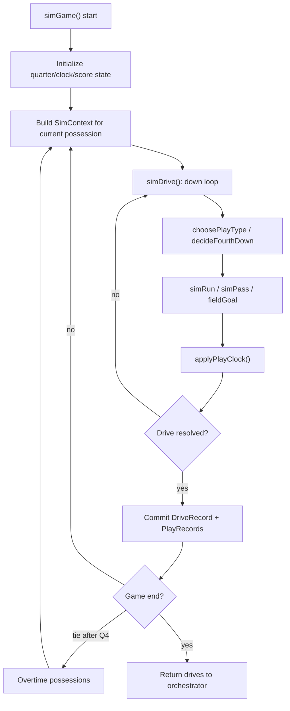
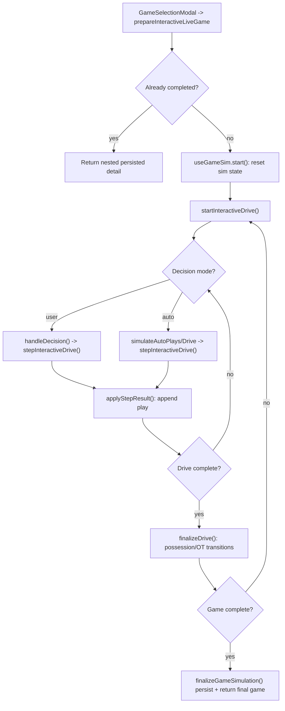

# Simulation Engine

## Purpose

Explains how a single game is simulated in CFB Sim, from possession initialization through finalization and persistence handoff. This covers both batch simulation (`advanceWeeks`) and interactive/live simulation (`useGameSim`).

## Simulation Model

The engine models football as a sequence of drives, and each drive as a sequence of plays. A drive has a single offense/defense pairing, a start field position, and an end condition (score, turnover, punt, half/game end, etc.).

A play combines:

- Situation: down, yards-to-go, field position, score margin, quarter/clock.
- Choice: run/pass (or 4th-down decision branch).
- Outcome: yards/result event (completion, sack, fumble, touchdown, etc.).
- Time effect: play duration, possible clock stops, quarter rollover.

The game result is produced by accumulating drive outcomes into `scoreA/scoreB`,
updating winner/result metadata, and then persisting one nested
`GameDetailRecord`.

## Execution

1. **Game hydration and context creation**
- `hydrateGame` converts a persisted `GameRecord` into in-memory `SimGame` shape.
- `SimContext` binds `league`, `game`, `starters`, offense/defense sides, current lead, and whether clock rules are active.

2. **Drive simulation loop**
- `simDrive` creates game-local drive/play identities for in-memory orchestration.
- For each down, the engine chooses play type, runs outcome simulation, applies
  clock, and appends a play.
- Loop exits when drive result is resolved (touchdown, FG attempt outcome, turnover, turnover on downs, safety, half/game end, etc.).

3. **Game-level orchestration**
- `simGame` repeatedly calls `simDrive`, flips possession, manages halftime kickoff reset behavior, and enters overtime if regulation is tied.
- Overtime uses possession-based rounds from `OT_START_YARD_LINE` until tie is broken.

4. **Batch integration path**
- `advanceWeeks` executes `simGame` for all unplayed games in target weeks.
- Batch path builds nested game detail, updates games, records, and rankings,
  derives a verified game story, then commits the simulation batch explicitly.

5. **Interactive integration path**
- `prepareInteractiveLiveGame` loads/hydrates the game and supporting caches.
- `useGameSim` executes `startInteractiveDrive` + repeated `stepInteractiveDrive` calls (auto or user decision).
- On completion, `finalizeGameSimulation` atomically writes the game, nested
  detail, persisted news story, and league state, then returns the UI-ready response.

## Game Rules

- **Play-calling weights**: `choosePlayType` adjusts pass probability by down/distance and late-game score/clock context; bounded by tuning min/max.
- **4th-down behavior**: `decideFourthDown` combines field position, yards to go, and urgency (`pointsNeeded`) to choose punt/FG/go.
- **Outcome sampling**: `simPass` and `simRun` use base rates and Gaussian yard models scaled by offense-vs-defense execution factors; home field can adjust effective ratings.
- **Clock behavior**:
  - Per-play duration sampled by play type + tempo multipliers.
  - Stop windows include incompletions, turnovers, scores, special teams, plus first-down/out-of-bounds windows defined by tuning.
- **Halftime/game boundaries**:
  - Quarter rollover handled in `applyPlayClock`.
  - Halftime marks drive end and flips opening logic for second-half offense.
- **Overtime**:
  - Possession-based, no normal regulation clock progression.
  - Interactive path tracks `inOvertime`, possession count, and repeated OT rounds.

## Invariants

- Drive and play IDs are deterministic game-local values derived from the game,
  drive number, and play number.
- `GameRecord` and in-memory `SimGame` must remain consistent on score, winner, overtime, and clock metadata before persistence.
- Interactive and batch paths share core simulation primitives (same drive/play logic), reducing mode-specific divergence.
- `starters` cache is assumed available for text/player-log generation quality.
- Published story copy is seeded by game ID and may only use facts extracted
  from persisted game, drive, play, player-log, and dynasty context.

## Failure Handling

- Missing league/game in prep paths throws and aborts flow.
- If a game is already complete, interactive setup bypasses simulation and returns stored artifacts.
- Overtime tie loops rely on winner emergence; guard loops in UI auto-sim prevent infinite client loops.
- Schedule anomalies (same team multiple games/week) are tolerated at orchestration layer with warnings, not hard failures.

## Source Map

- `src/domain/sim/engine.ts`
  - `simGame`, `simDrive`, `startInteractiveDrive`, `stepInteractiveDrive`, `finalizeGameResult`
  - constants/utils: `OT_START_YARD_LINE`, `isTeamAOpeningOffense`, `buildDriveResponse`, `buildGameData`
- `src/domain/sim/clock.ts`
  - `applyPlayClock`, `getTempo`, `totalSecondsLeft`, `isOutOfBoundsResult`
- `src/domain/sim/playcalling.ts`
  - `choosePlayType`, `decideFourthDown`, `pointsNeeded`
- `src/domain/sim/outcomes.ts`
  - `simPass`, `simRun`, `fieldGoal`
- `src/domain/sim/orchestrator.ts`
  - `advanceWeeks`, `prepareInteractiveLiveGame`, `finalizeGameSimulation`
- `src/components/sim/useGameSim.ts`
  - `start`, `handleDecision`, `simulateAutoDrive`, `simulateToEnd`, finalize/persistence integration
